# AI Token Meter — Codex & Claude Code Usage, Quota and Cost Tracker for macOS

[中文说明](README.md) · [Download the latest release](https://github.com/prefect12/codex-token-meter/releases/latest)

AI Token Meter (formerly Codex Token Meter) is a free, open-source, native **macOS menu bar token usage tracker** for **OpenAI Codex / Codex CLI** and **Anthropic Claude Code**. It monitors local token usage, cache hit rate, live 5-hour and weekly quota remaining, reset times, model-level usage, and API-equivalent cost.

Use it as a **Codex token usage tracker**, **Claude Code usage monitor**, **Codex quota meter**, or **Claude Code token counter**. It reads local logs without requiring an account or API key, and never uploads your conversations.

## Why AI Token Meter

- **Codex and Claude Code in one dashboard** — compare both coding agents from the macOS menu bar.
- **Quota and tokens stay distinct** — official rate-limit windows and local token counts are clearly labeled.
- **Local-first and private** — prompts, code, and session logs remain on your Mac.
- **Cost and cache analytics** — inspect input, output, cached input, cache hit rate, and per-model API-equivalent cost.
- **Native macOS app** — a lightweight AppKit experience for Apple Silicon and Intel Macs.

> [Download AI Token Meter for macOS from GitHub Releases](https://github.com/prefect12/codex-token-meter/releases/latest)

It reads your local Codex session logs and Claude Code project logs directly:

```text
~/.codex/sessions/**/rollout-*.jsonl
~/.codex/archived_sessions/rollout-*.jsonl
$CODEX_HOME/sessions/**/rollout-*.jsonl
$CODEX_HOME/archived_sessions/rollout-*.jsonl
~/.claude/projects/**/*.jsonl
```

When available, it also reads live quota data directly from the normal ChatGPT Codex usage endpoint with your existing local login, including the 5-hour window, weekly window, reset time, and remaining percentage.

## Screenshots

All screenshots below are rendered with the built-in `--redact` mode: repository names and local directories are replaced with demo data.

### Menu Bar Dashboard

<p align="center">
  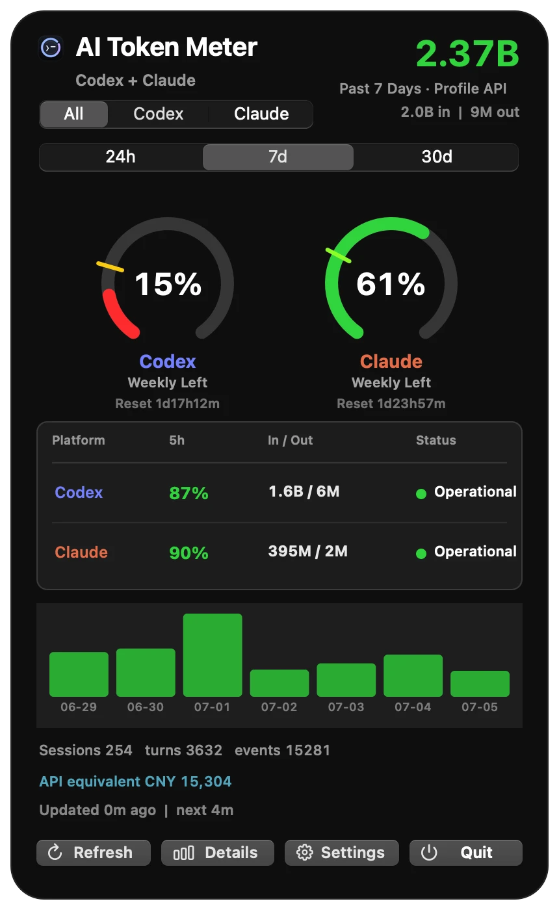
</p>

Switch between `All / Codex / Claude` and `24h / 7d / 30d`. Platform quota rings, a 5-hour pressure comparison table, 7-day usage bars, and API-equivalent cost in one panel.

### Details Overview

<p align="center">
  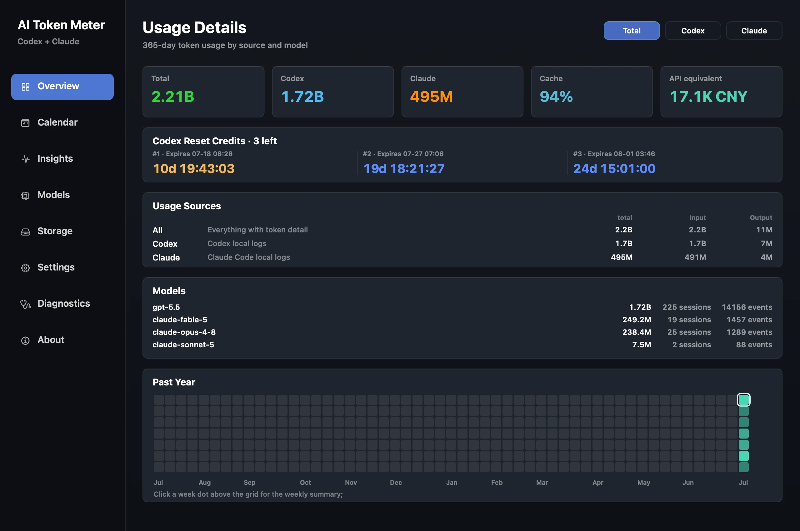
</p>

365-day totals by source and model, input/output breakdown, and a full-year activity heatmap.

### Repository Insights

<p align="center">
  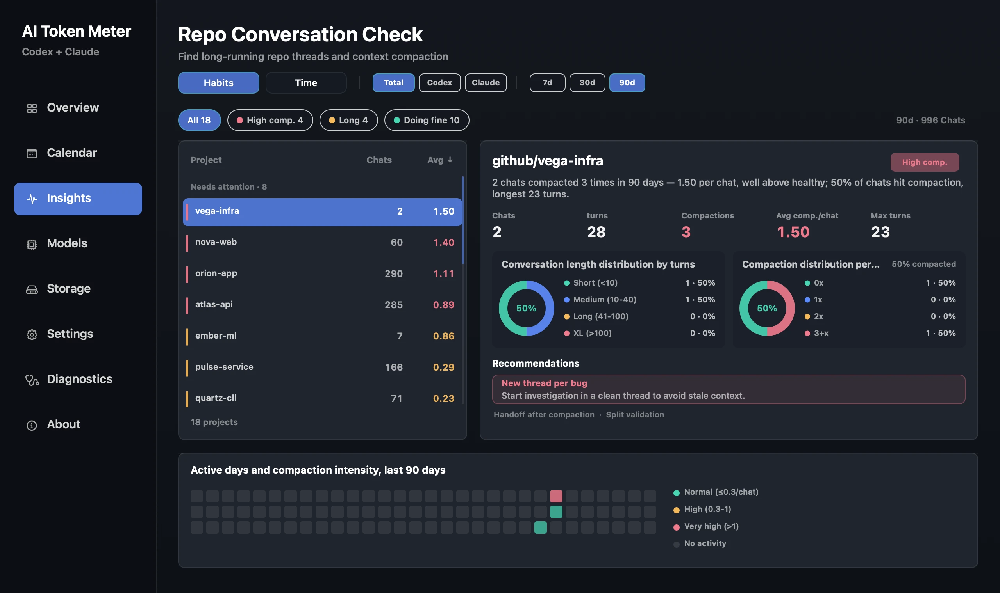
</p>

Repo conversation check: find long-running threads and context-compaction pressure per project, with length/compaction distributions, active-day intensity, and split-thread recommendations.

### Activity Calendar

<p align="center">
  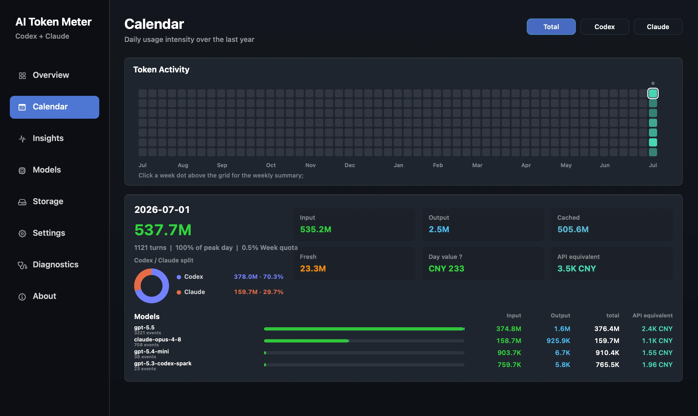
</p>

Click a day for its detail card: input/output/cache split, Codex vs Claude share, that day's subscription value, and API-equivalent cost. Click the dot above a column for a weekly summary.

### Models

<p align="center">
  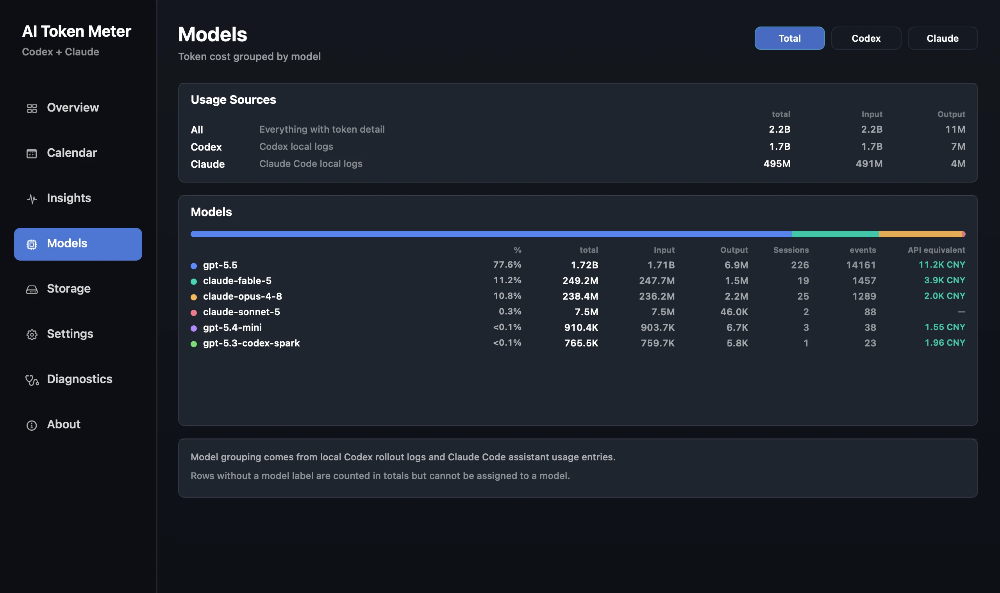
</p>

Per-model token aggregation, share bar, session/event counts, and per-model API-equivalent cost.

### Storage

<p align="center">
  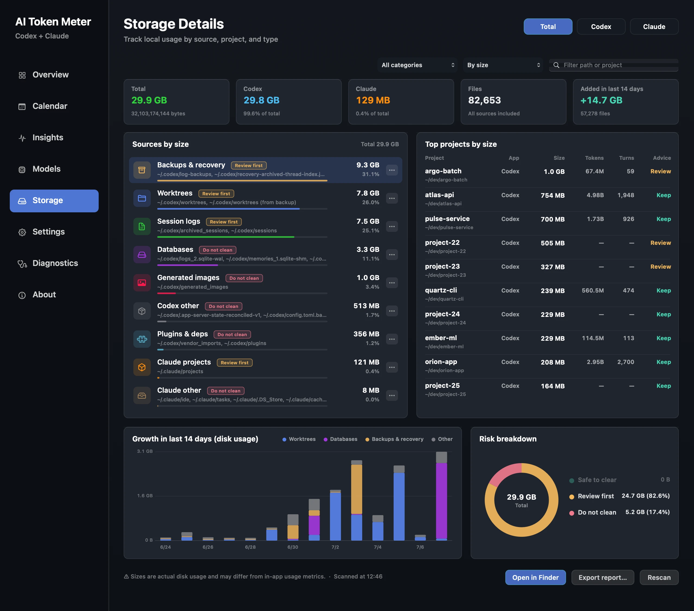
</p>

Track local log disk usage by source, project, and category: 14-day growth, largest projects, cleanup-risk composition, report export, and open-in-Finder.

### Settings

<p align="center">
  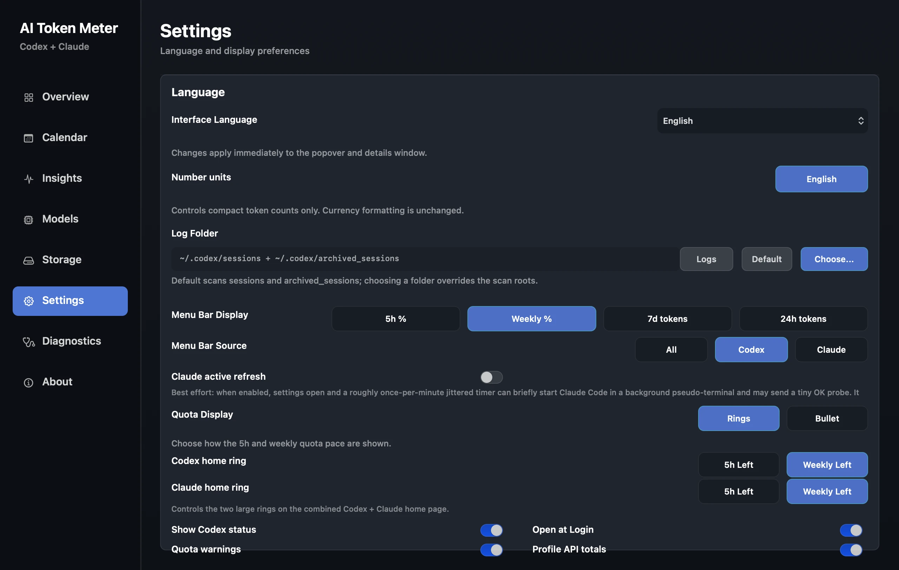
</p>

Interface language, number units, log folders, status-bar display and source, quota style, home-ring metrics, launch at login, and more.

### Diagnostics

<p align="center">
  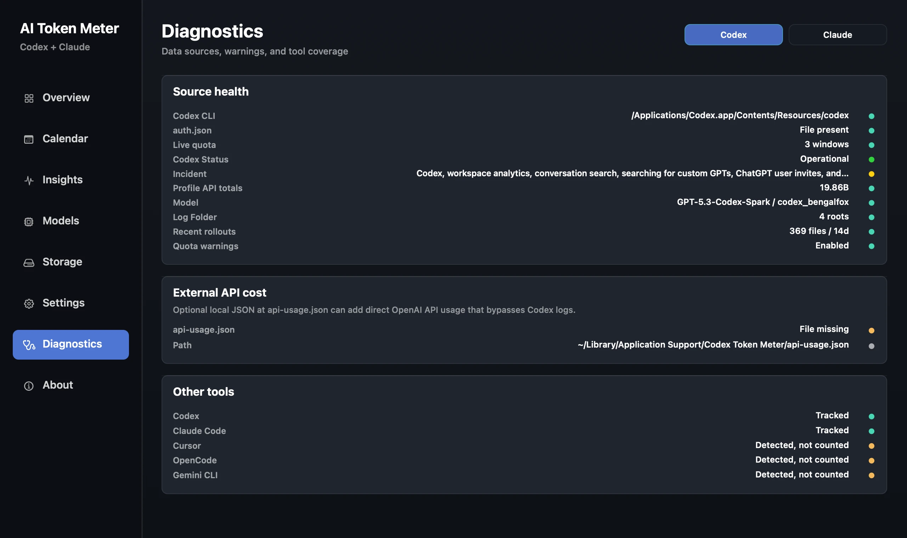
</p>

<details>
<summary>Chinese UI preview</summary>

### 状态栏面板

<p align="center">
  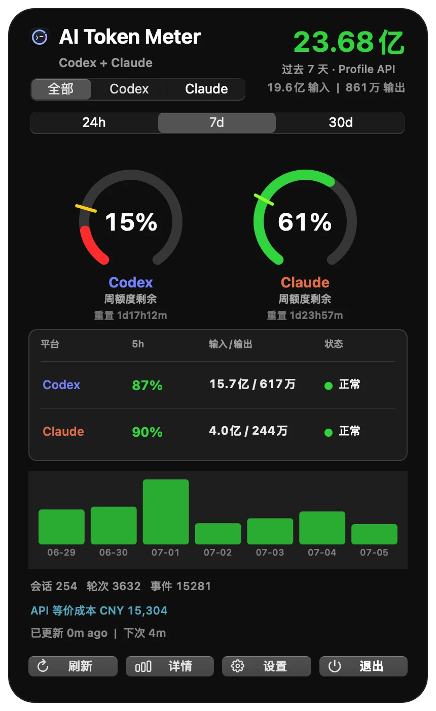
</p>

### 仓库洞察

<p align="center">
  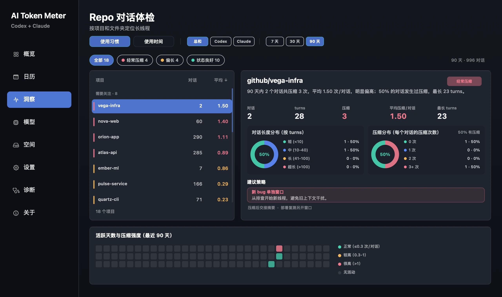
</p>

### 详情概览

<p align="center">
  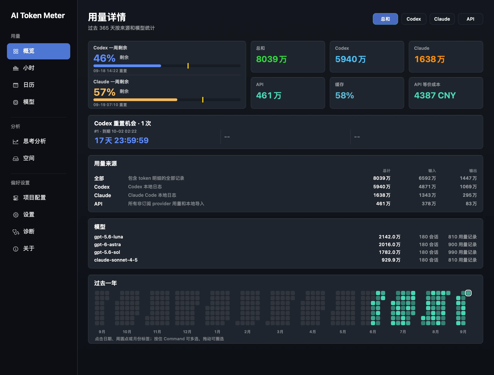
</p>

### 活动日历

<p align="center">
  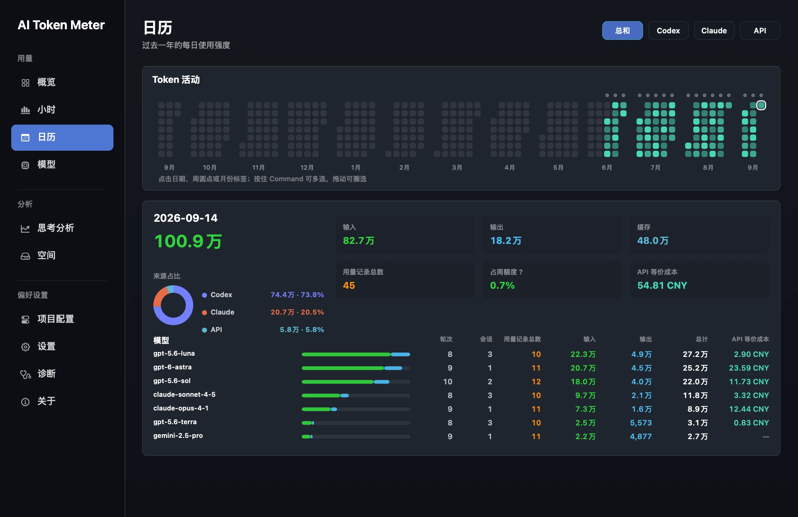
</p>

### 空间

<p align="center">
  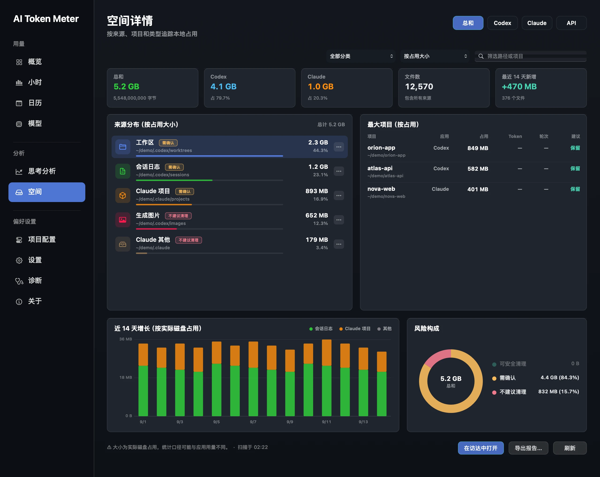
</p>

### 诊断

<p align="center">
  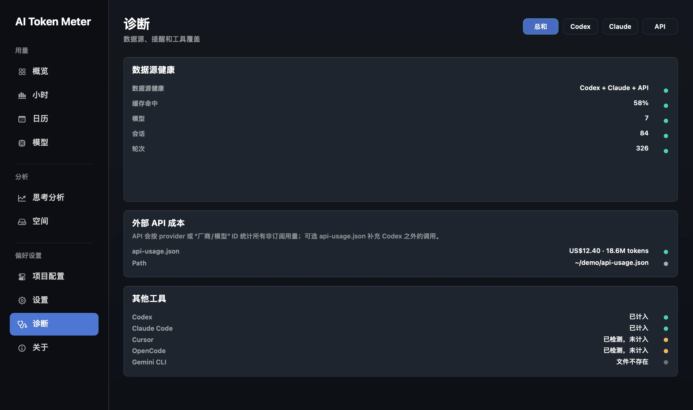
</p>

</details>

## Features

- Menu bar status item showing remaining quota, weekly quota, daily tokens, or weekly tokens.
- Compact popover with `24h / 7d / 30d` windows.
- `All / Codex / Claude` source switching, plus model-limit and non-model-limit views inside Codex usage.
- The `All` dashboard shows Codex / Claude weekly quota rings, 5-hour pressure, input/output, status links, and time-window usage bars.
- The Claude view can use Claude Code statusline `rate_limits` for official 5-hour and 7-day usage percentages; without that hook it still shows local-log usage.
- Live 5-hour and weekly quota pacing, with either ring or bullet-style display.
- Cache hit-rate ring.
- Compact Codex service-status chip sourced from `status.openai.com`, with a settings toggle to show or hide it.
- Token breakdown for input, output, cached input, fresh input, and total tokens.
- Details window with overview, calendar, insights, models, storage, settings, diagnostics, and about pages.
- The menu dashboard and details window cache aggregate snapshots, showing the last complete result first and refreshing in the background.
- Insights page that groups local Codex and Claude Code conversations by repository or folder, highlights long-running threads, context-compaction pressure, active worktrees, and split-thread recommendations.
- 365-day activity calendar with daily detail cards and clickable weekly-summary dots.
- Model-level aggregation for long-term usage analysis, including per-model API-equivalent cost.
- Storage page that tracks local log disk usage by source, project, and category, with 14-day growth, cleanup-risk composition, report export, and open-in-Finder.
- Built-in `--render-dashboard` / `--render-details` screenshot rendering; add `--redact` to replace repository names and local directories with demo data for public sharing.
- Diagnostics page for Codex CLI/auth health, live quota availability, log coverage, optional API cost input, and other tool detection.
- Default scan coverage for current sessions, archived sessions, and `CODEX_HOME` when that environment variable is set.
- Localized UI for English, Simplified Chinese, Traditional Chinese, Japanese, French, German, Spanish, and Korean.
- Language-aware number units: English uses `K / M / B`; Chinese uses `万 / 亿`.
- Configurable Codex log folder, menu bar display mode, quota display style, Codex status chip, launch at login, and low-quota notifications.
- Manual refresh, local log folder shortcut, and CLI inspection mode.

## Data And Calculation Model

AI Token Meter uses local data sources:

- **Token usage** comes from local Codex session logs and Claude Code project logs. Codex scans `~/.codex/sessions`, `~/.codex/archived_sessions`, and matching `sessions` / `archived_sessions` folders under `$CODEX_HOME` when that environment variable is set. If you choose a custom log folder in Settings, that folder overrides the default Codex roots. Codex scans `token_count` events, reads `input_tokens`, `cached_input_tokens`, `output_tokens`, `reasoning_output_tokens`, and `total_tokens`, then calculates the delta between adjacent cumulative counters. Claude Code scans `*.jsonl` assistant usage records under `CLAUDE_CONFIG_DIR`, `$XDG_CONFIG_HOME/claude/projects`, and `~/.claude/projects`; reads `input_tokens`, `cache_creation_input_tokens`, `cache_creation.ephemeral_5m_input_tokens`, `cache_creation.ephemeral_1h_input_tokens`, `cache_read_input_tokens`, and `output_tokens`; keeps the final/largest token snapshot for the same message; then aggregates by hour, day, session, model, and repository.
- **Dashboard cache** stores local aggregate reports for `24h / 7d / 30d` and `All / Codex / Claude` in `dashboard-report-cache.json`. On launch or window switching, the menu dashboard shows the last aggregate first and refreshes in the background. Raw log content is not cached there.
- **Details cache** stores the aggregate snapshot needed by the 365-day overview, calendar, cost, model, and repository-insight pages in `details-snapshot-cache.json`. Opening the details window shows the last snapshot first, then recomputes in the background and replaces it. The cache removes top-session paths and real repository paths, keeping only display names and aggregate statistics.
- **Live quota percentages** come from a direct read-only request to the normal ChatGPT Codex usage endpoint for Codex and from optional Claude Code statusline capture for Claude. The app does not start `codex app-server`. It reuses the existing local ChatGPT login, caches successful results, and backs off for 1, 5, then 15 minutes after failures while keeping the normal successful refresh interval at 15 seconds. Claude can use `--claude-statusline` to capture official `rate_limits` from Claude Code statusline JSON. Remaining quota in the menu bar and quota rings is displayed as `100 - usedPercent`. The app learns the current non-Codex model-level quota window from the live response instead of relying only on the historical Spark ID.
- **Cache percentage** comes from local token detail and is calculated as `cached_input_tokens / input_tokens * 100`.
- **Cost estimates** are not official billing. Codex and Claude each keep their own monthly plan cost, payment currency, display currency, and payment start date, defaulting from the legacy `$200` setting. Weekly budget is `that platform's monthly plan cost * 12 / 52`. Current-week used value prefers that platform's live weekly `usedPercent`. Historical days and weeks are estimated from local token usage, historical peaks, and recorded weekly quota percentages. The All cost view converts the Codex and Claude monthly plans from their own payment currencies into the selected display currency before summing them.
- **API-equivalent cost** is a separate estimate. It answers: "if this same local token usage had been billed directly through API-style token pricing, roughly how much would it cost?" The app prices recognized models by token type: fresh input, cached input, and output. Current built-in rates use the official API prices for GPT-5.6 Sol / Terra / Luna, GPT-5.5, GPT-5.4, and GPT-5.4 mini, the token-based Codex rate-card equivalent for GPT-5.3-Codex / GPT-5.2-style Codex models, and official Claude Opus / Sonnet / Haiku API prices. GPT-5.6 cache writes use the official 1.25× input rate when the source reports cache-creation tokens; current local Codex `token_count` events expose cache reads but not cache writes, so unseparated input uses the normal input rate. `reasoning_output_tokens` is not added again because local `total_tokens` already equals input plus output in Codex token-count events. Total-only Profile API rows without a model label use a GPT-5.6 Sol fresh-input fallback so single-day API totals still show a realistic amount. Unknown model labels are left unpriced and reduce the displayed priced-token coverage.
- **Repo insights** are derived locally from rollout metadata and events. The insights scanner reads `cwd`, `turn` activity, `context_compacted` signals, and `token_count` deltas, then groups normal `Documents/github/<repo>` work and Codex-created worktrees back to the same repository display name. It reports conversations, turns, compactions, longest-thread pressure, active days, and recommendations for when to split work into a fresh thread.
- **Codex speed tier / fast mode** is not reconstructed from historical local logs. Current `rollout-*.jsonl` metadata does not expose whether a past request used standard or fast speed, so the app does not infer fast mode from reasoning effort or other indirect fields. If a future Codex data source exposes the speed tier per request, it can be priced explicitly.
- **External API cost** is an optional local JSON input for direct OpenAI API usage that bypasses Codex logs. By default the app reads `~/Library/Application Support/Codex Token Meter/api-usage.json` when present. Supported keys include `usd_value`, `total_usd`, `usd`, or `cost_usd` for cost, plus `total_tokens`, `tokens`, or `usage_tokens` for token count. The renamed AI Token Meter app intentionally keeps the old support folder so upgrades preserve settings, caches, and local cost files.

Example external API cost file:

```json
{
  "usd": 12.34,
  "total_tokens": 123456,
  "updated_at": "2026-06-15T00:00:00Z"
}
```

If OpenAI resets or refreshes your quota during a week, the live weekly percentage follows the new `usedPercent`, so the menu bar and weekly quota ring may suddenly show more remaining quota. Local token logs are not cleared. The cost page records observed weekly-percentage drops and keeps the highest weekly percentage seen for historical weeks so past estimated value is not overwritten by a later low live percentage. This is still a local observation-based estimate, not an official billing export.

If you run work through Codex CLI or the Codex app with API-based authentication, local token usage can still be counted as long as Codex continues writing local `rollout-*.jsonl` logs. ChatGPT subscription quota requires a local ChatGPT login in one of the configured Codex homes; API-key-only homes do not expose that subscription quota. Direct OpenAI API calls that bypass the local Codex client can be represented through the optional local `api-usage.json` file; the app does not call billing APIs itself.

## Recent Updates

- `0.2.17` adds remaining-quota pace markers for Codex and Claude, improves details scrolling and background scanning, and fixes automatic Claude Keychain prompts, subagent model attribution, and `claude-opus-5` API-equivalent pricing. Task Bar `0.1.18` adds plan-progress hover details and fixes SQLite process accumulation, resurfacing historical subtasks, and hover-panel positioning.
- `0.2.6` adds Codex reset-credit countdowns in the details overview, including per-credit granted/expiry hover details; Task Bar also includes the latest title/status/count visibility fixes from the 0.1.6 bundle.
- `0.2.5` temporarily hides the quota-cycles page until its interaction design is finalized; cycle data is still recorded locally so history is preserved.
- Added the `--redact` screenshot-rendering mode that replaces repository names and local directories with demo data for public sharing.
- Calendar weekly summaries moved from hover tooltips to clickable week dots.
- Details pages now use a full-width layout, and the settings page render height is fixed.
- Fixed model share-bar overlap on the models page.
- The diagnostics page now shows the Codex CLI path with `~` abbreviation.
- `0.2.0` renames the app to AI Token Meter. The installed bundle is now `/Applications/AI Token Meter.app`; `install.sh` removes the old `/Applications/Codex Token Meter.app` bundle while keeping the legacy App Support directory for local data.
- Added a combined Codex + Claude home dashboard with two platform quota rings, a platform comparison table, 24h/7d/30d usage bars, and platform-specific hover details.
- Added Claude Code local-log scanning for assistant usage JSONL under `~/.claude/projects`, `CLAUDE_CONFIG_DIR`, and `$XDG_CONFIG_HOME/claude/projects`.
- Added Claude Code statusline integration for official 5-hour and 7-day quota percentages; local-log usage still works without the statusline hook.
- Individual Codex and Claude tabs keep the original three-ring plus bar-chart view; only the `All` home tab uses the new platform overview table.
- Cost settings now keep separate Codex and Claude plan costs and currencies instead of sharing one monthly-plan estimate.
- Menu dashboard aggregate reports are cached on disk, and refreshes keep the previous platform input/output values visible instead of briefly showing `-- / --`.
- The details window now caches and prewarms its aggregate snapshot, so it can show the previous full page immediately and refresh to the latest data in the background.
- Added a repository insights page for identifying long-running Codex threads, context compaction pressure, active worktrees, and project-specific split-thread recommendations.
- Updated the insights project list to show the final repository folder name, so paths such as `github/CampaignStrategy` and `github/CodexTokenMeter` render as `CampaignStrategy` and `CodexTokenMeter`.
- Split the former single 9k-line Swift entrypoint into focused source files for domain models, settings, scanning, cost estimation, dashboard UI, details UI, app orchestration, and CLI helpers.
- Added `AGENTS.md` and `docs/ARCHITECTURE.md` so AI-assisted development can target the right file and preserve token, quota, and cost-accounting invariants.
- Updated the build script to automatically compile every Swift source file under `Sources/CodexTokenMeter`.
- Added day-level per-rollout aggregate caching so `7d`, `30d`, and yearly detail scans reuse derived summaries instead of re-walking every cached event.
- Kept the rolling `24h` window event-accurate while speeding up natural-day windows and details-page warm scans.
- Added migration from the older parsed-rollout cache format to the new aggregate cache without rereading unchanged JSONL logs.
- Improved menu popover readability with stronger secondary text contrast and SF Symbol icons on the main actions.
- Added basic accessibility labels for quota rings, segmented controls, settings inputs, popups, and switches.
- Added a compact Codex service-status chip backed by `status.openai.com`, plus `--print-service-status` for diagnostics.
- Added quota display settings for ring or bullet-style 5-hour and weekly pacing.
- Fixed quota wording and visuals to emphasize remaining quota instead of mixing used and remaining semantics.
- Added a GPT-5.5 fallback for total-only Profile API usage so single-day amount estimates do not show zero when token coverage is available.
- Centralized historical cost and quota-value estimation into one shared `CostEstimator` path used by calendar details, model rows, amount totals, tooltips, and cost history.
- Fixed language-aware number units and tightened localized layout spacing in the details window.

## Codex Official Best Practices

This repository applies several practices from the official [Codex best practices](https://developers.openai.com/codex/learn/best-practices), [prompting](https://developers.openai.com/codex/prompting), and [AGENTS.md](https://developers.openai.com/codex/guides/agents-md) guidance:

- Give Codex clear task context: include the goal, relevant files or errors, constraints, and "done when" criteria before asking for code changes.
- Plan first for difficult work: use Plan mode or ask Codex to interview you before implementation when the request is ambiguous, risky, or likely to span multiple files.
- Keep reusable guidance in `AGENTS.md`: repository layout, build commands, verification checks, accounting invariants, privacy rules, and PR expectations should live in durable instructions instead of being repeated in each prompt.
- Keep instructions practical and scoped: a short, accurate `AGENTS.md` is preferred; split larger guidance into focused docs such as `docs/ARCHITECTURE.md`.
- Configure Codex deliberately: use `config.toml` for durable defaults such as model, reasoning effort, sandbox mode, approval policy, and MCP setup; use one-off overrides only for one-off tasks.
- Keep sandboxing and approvals tight by default: use broader access only for trusted workflows, and prefer explicit writable roots or allow rules over removing boundaries entirely.
- Validate and review changes: ask Codex to run the relevant build, CLI, render, lint, or test checks; inspect the diff before accepting or merging.
- Turn repeated workflows into skills: focused skills should package instructions, references, and optional scripts for repeatable work such as release prep, review, or diagnostics.
- Use MCP for live external context: connect Codex to tools such as official docs, GitHub, browser automation, or design systems when a task depends on data outside the repository.
- Use hooks and automations carefully: hooks can enforce checks at lifecycle points, and automations can run recurring work, but unattended workflows should keep conservative permissions and reviewable outputs.

## Privacy

This repository contains only app source code and static assets. It does not include your Codex logs, token usage data, screenshots, build artifacts, or DMG files.

At runtime, the app reads:

```text
~/.codex/sessions
~/.codex/archived_sessions
$CODEX_HOME/sessions
$CODEX_HOME/archived_sessions
~/Library/Application Support/Codex Token Meter/ParsedRollouts
~/Library/Application Support/Codex Token Meter/api-usage.json
```

Those files are used locally on your Mac. The app does not upload session logs. For upgrade compatibility, the App Support folder name remains `Codex Token Meter`. It makes read-only requests to `https://status.openai.com/api/v2/summary.json` for the Codex status chip and to normal `https://chatgpt.com/backend-api/wham/` usage endpoints for live quota, Profile totals, and reset credits. It reads the existing local ChatGPT access token only to authenticate those requests and never starts a Codex runtime for polling.

## Build

Requirements:

- macOS 13 or later
- Xcode Command Line Tools
- `swiftc`

Build the app:

```bash
./build.sh
```

Build output:

```text
build/AI Token Meter.app
```

Install to `/Applications` and launch:

```bash
./install.sh
```

Package a DMG:

```bash
./package_dmg.sh
```

DMG output:

```text
dist/AI-Token-Meter-<version>.dmg
```

## CLI Inspection

The built app can print parsed statistics from the command line, which is useful when checking parser behavior:

```bash
"./build/AI Token Meter.app/Contents/MacOS/CodexTokenMeter" --print --hours=168
```

Example with a specific window and quota view:

```bash
"./build/AI Token Meter.app/Contents/MacOS/CodexTokenMeter" --print --window=month --quota=all
"./build/AI Token Meter.app/Contents/MacOS/CodexTokenMeter" --print --window=week --quota=claude
```

To show official Claude Code 5-hour / 7-day quota percentages in the app, configure Claude Code statusline to run:

```bash
"/Applications/AI Token Meter.app/Contents/MacOS/CodexTokenMeter" --claude-statusline
```

To inspect the OpenAI/Codex status feed directly:

```bash
"./build/AI Token Meter.app/Contents/MacOS/CodexTokenMeter" --print-service-status
```

To render the details window for visual checks, including the insights page:

```bash
"./build/AI Token Meter.app/Contents/MacOS/CodexTokenMeter" --render-details=/tmp/ai-token-meter-insights.png --section=insights --insight-window=90
```

The JSON output includes `model_limit_id`, `model_limit_name`, API-equivalent cost fields, `external_api_cost` status, and service-status fields when using `--print-service-status`.

## Project Layout

```text
Sources/CodexTokenMeter/main.swift   Command-line entrypoints and app startup
Sources/CodexTokenMeter/*.swift      Domain, settings, scanner, cost, and AppKit UI modules
Resources/                          App icons and menu bar assets
Tools/                              Icon generation scripts
docs/ARCHITECTURE.md                Code map, data flow, invariants, and refactor path
AGENTS.md                           Development guide for AI-assisted changes
Info.plist                          macOS app metadata
build.sh                            Builds the .app bundle
install.sh                          Installs to /Applications
package_dmg.sh                      Packages the DMG
```

## License

MIT
