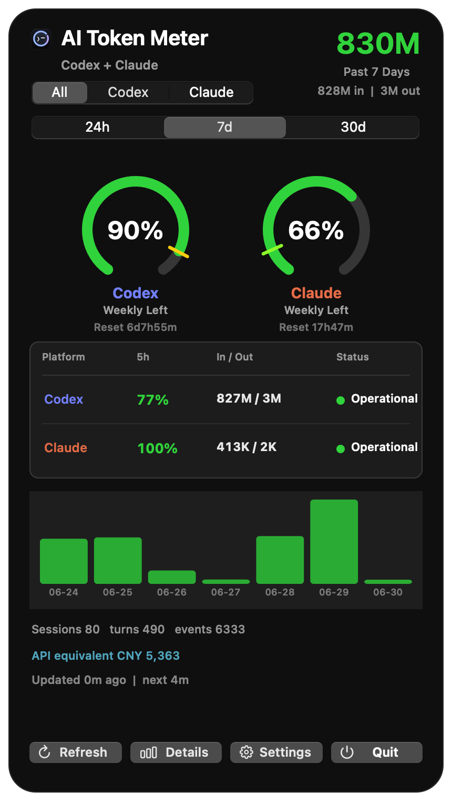
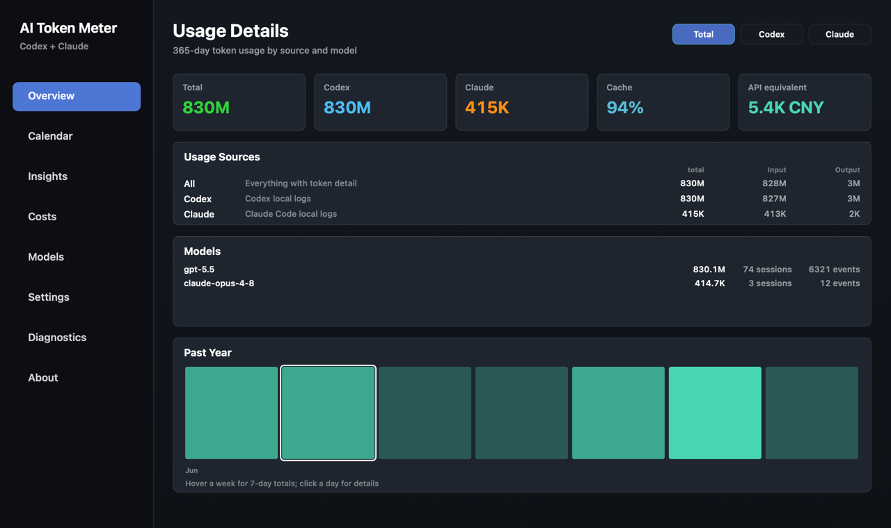
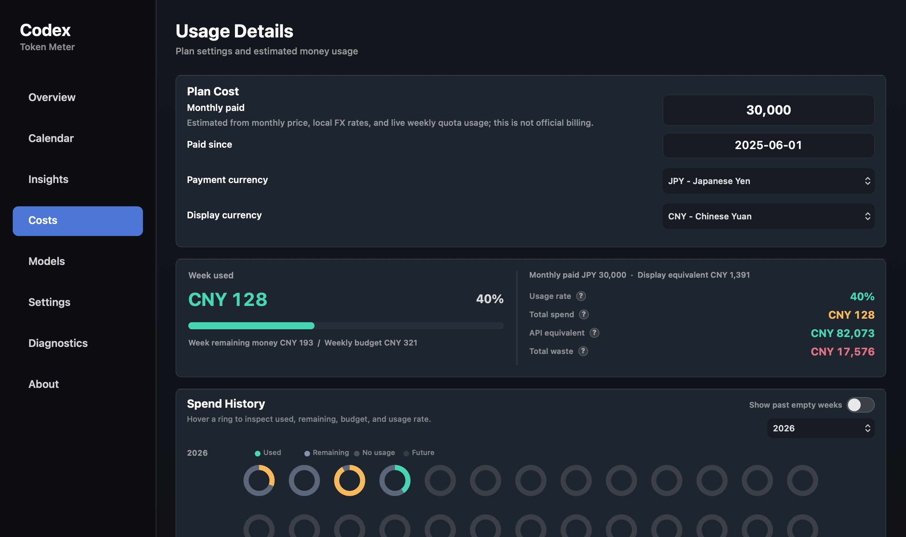
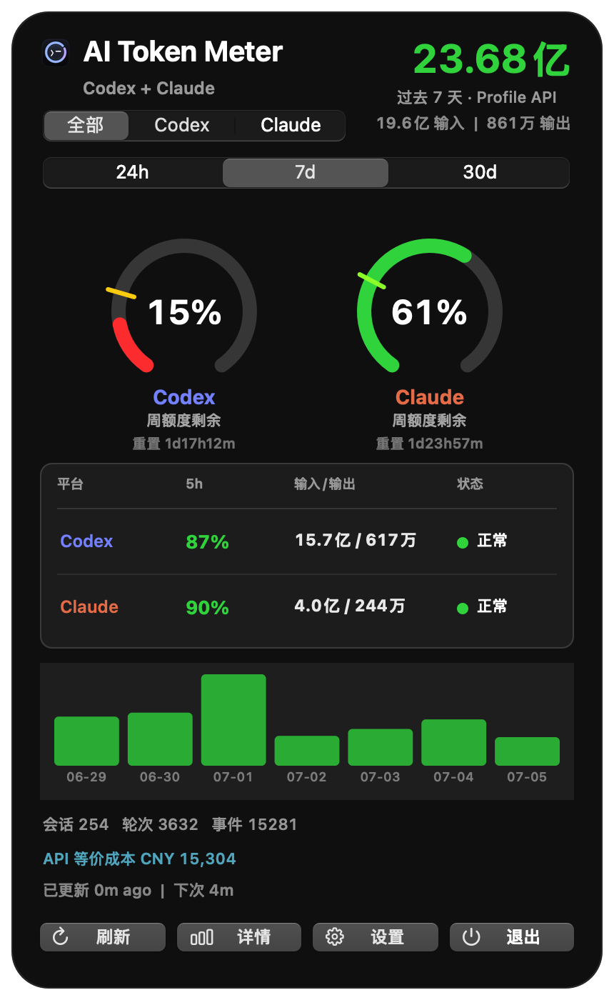
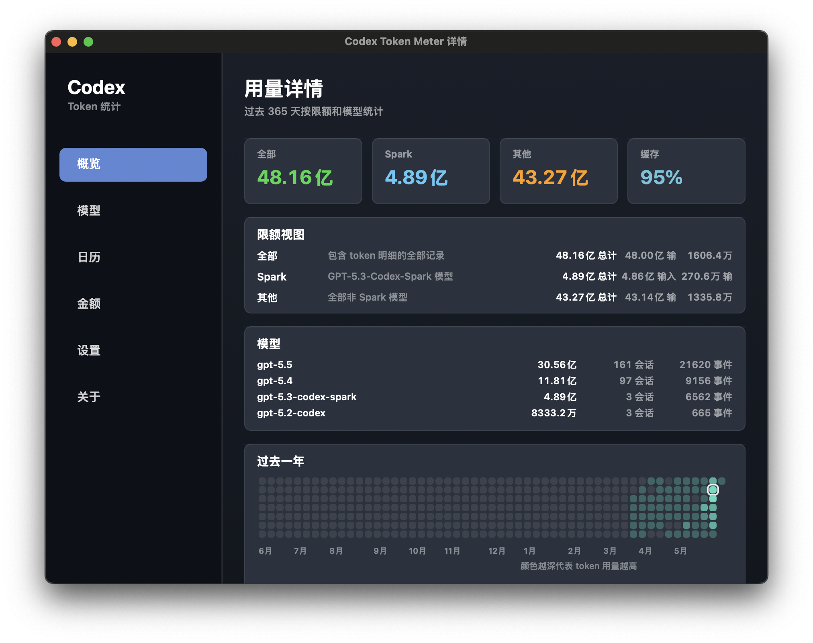
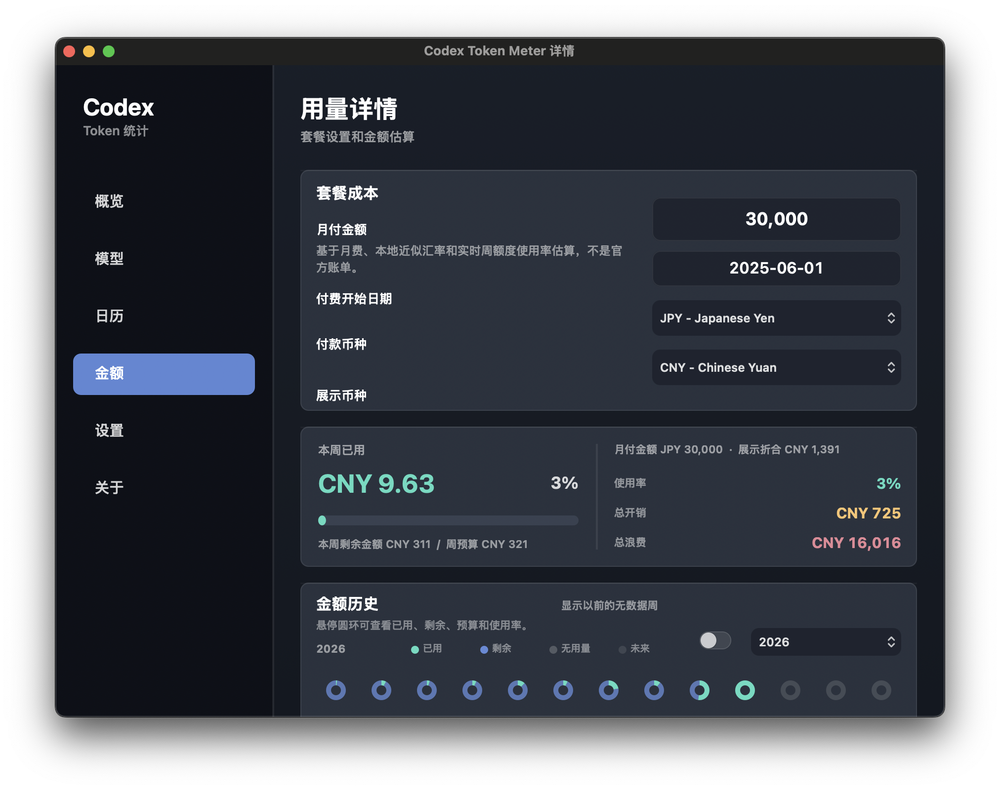

# Codex Token Meter

[中文说明](README.zh-CN.md)

Codex Token Meter is a native macOS menu bar app for tracking local Codex token usage, cache hit rate, live quota remaining, model-level usage, and estimated subscription value.

It reads your local Codex session logs directly:

```text
~/.codex/sessions/**/rollout-*.jsonl
~/.codex/archived_sessions/rollout-*.jsonl
$CODEX_HOME/sessions/**/rollout-*.jsonl
$CODEX_HOME/archived_sessions/rollout-*.jsonl
```

When available, it also reads live quota data from the local Codex runtime, including the 5-hour window, weekly window, reset time, and remaining percentage.

## Screenshots

### Menu Bar Dashboard



### Details Window



### Cost And Budget Tracking



<details>
<summary>Chinese UI preview</summary>







</details>

## Features

- Menu bar status item showing remaining quota, weekly quota, daily tokens, or weekly tokens.
- Compact popover with `24h / 7d / 30d` windows.
- `All / model limit / Other` quota views for total Codex usage, the current learned model-level limit, and non-model-limit usage.
- Live 5-hour and weekly quota pacing, with either ring or bullet-style display.
- Cache hit-rate ring.
- Compact Codex service-status chip sourced from `status.openai.com`, with a settings toggle to show or hide it.
- Token breakdown for input, output, cached input, fresh input, and total tokens.
- Details window with overview, insights, calendar, cost, model, settings, diagnostics, and about pages.
- Insights page that groups local Codex conversations by repository or folder, highlights long-running threads, context-compaction pressure, active worktrees, and split-thread recommendations.
- 365-day activity calendar with daily detail cards.
- Model-level aggregation for long-term usage analysis.
- Cost page for monthly plan cost, remaining budget, historical spend, estimated daily value, API-equivalent token cost, and optional external API cost.
- Diagnostics page for Codex CLI/auth health, live quota availability, log coverage, optional API cost input, and other tool detection.
- Default scan coverage for current sessions, archived sessions, and `CODEX_HOME` when that environment variable is set.
- Localized UI for English, Simplified Chinese, Traditional Chinese, Japanese, French, German, Spanish, and Korean.
- Language-aware number units: English uses `K / M / B`; Chinese uses `万 / 亿`.
- Configurable Codex log folder, menu bar display mode, quota display style, Codex status chip, launch at login, low-quota notifications, payment currency, display currency, and payment start date.
- Manual refresh, local log folder shortcut, and CLI inspection mode.

## Data And Calculation Model

Codex Token Meter uses local data sources:

- **Token usage** comes from local Codex session logs. By default the app scans `~/.codex/sessions`, `~/.codex/archived_sessions`, and matching `sessions` / `archived_sessions` folders under `$CODEX_HOME` when that environment variable is set. If you choose a custom log folder in Settings, that folder overrides the default roots. The app scans `token_count` events, reads `input_tokens`, `cached_input_tokens`, `output_tokens`, `reasoning_output_tokens`, and `total_tokens`, calculates the delta between adjacent cumulative counters, and aggregates those deltas by hour, day, session, and model.
- **Live quota percentages** come from the local Codex runtime. The app starts `codex app-server`, calls `account/rateLimits/read`, and reads fields such as `usedPercent` and `resetsAt` for the 5-hour and weekly windows. Remaining quota in the menu bar and quota rings is displayed as `100 - usedPercent`. The app learns the current non-Codex model-level quota window from the live response instead of relying only on the historical Spark ID.
- **Cache percentage** comes from local token detail and is calculated as `cached_input_tokens / input_tokens * 100`.
- **Cost estimates** are not official billing. The monthly plan cost comes from settings and defaults to `$200`; weekly budget is `monthly plan cost * 12 / 52`. Current-week used value prefers the live weekly `usedPercent`. Historical days and weeks are estimated from local token usage, historical peaks, and recorded weekly quota percentages.
- **API-equivalent cost** is a separate estimate. It answers: "if this same local Codex token usage had been billed directly through API-style token pricing, roughly how much would it cost?" The app prices recognized models by token type: fresh input, cached input, and output. Current built-in rates use the official API prices for GPT-5.5, GPT-5.4, and GPT-5.4 mini, plus the token-based Codex rate-card equivalent for GPT-5.3-Codex / GPT-5.2-style Codex models. `reasoning_output_tokens` is not added again because local `total_tokens` already equals input plus output in Codex token-count events. Total-only Profile API rows without a model label use a GPT-5.5 fresh-input fallback so single-day API totals still show a realistic amount. Unknown model labels are left unpriced and reduce the displayed priced-token coverage.
- **Repo insights** are derived locally from rollout metadata and events. The insights scanner reads `cwd`, `turn` activity, `context_compacted` signals, and `token_count` deltas, then groups normal `Documents/github/<repo>` work and Codex-created worktrees back to the same repository display name. It reports conversations, turns, compactions, longest-thread pressure, active days, and recommendations for when to split work into a fresh thread.
- **Codex speed tier / fast mode** is not reconstructed from historical local logs. Current `rollout-*.jsonl` metadata does not expose whether a past request used standard or fast speed, so the app does not infer fast mode from reasoning effort or other indirect fields. If a future Codex data source exposes the speed tier per request, it can be priced explicitly.
- **External API cost** is an optional local JSON input for direct OpenAI API usage that bypasses Codex logs. By default the app reads `~/Library/Application Support/Codex Token Meter/api-usage.json` when present. Supported keys include `usd_value`, `total_usd`, `usd`, or `cost_usd` for cost, plus `total_tokens`, `tokens`, or `usage_tokens` for token count.

Example external API cost file:

```json
{
  "usd": 12.34,
  "total_tokens": 123456,
  "updated_at": "2026-06-15T00:00:00Z"
}
```

If OpenAI resets or refreshes your quota during a week, the live weekly percentage follows the new `usedPercent`, so the menu bar and weekly quota ring may suddenly show more remaining quota. Local token logs are not cleared. The cost page records observed weekly-percentage drops and keeps the highest weekly percentage seen for historical weeks so past estimated value is not overwritten by a later low live percentage. This is still a local observation-based estimate, not an official billing export.

If you run work through Codex CLI or the Codex app with API-based authentication, local token usage can still be counted as long as Codex continues writing local `rollout-*.jsonl` logs. Live quota percentages depend on whether `codex app-server` can return `account/rateLimits/read` for that authentication mode. Direct OpenAI API calls that bypass the local Codex client can be represented through the optional local `api-usage.json` file; the app does not call billing APIs itself.

## Recent Updates

- Added a repository insights page for identifying long-running Codex threads, context compaction pressure, active worktrees, and project-specific split-thread recommendations.
- Updated the insights project list to show the final repository folder name, so paths such as `github/CampaignStrategy` and `github/CodexTokenMeter` render as `CampaignStrategy` and `CodexTokenMeter`.
- Split the former single 9k-line Swift entrypoint into focused source files for domain models, settings, scanning, cost estimation, dashboard UI, details UI, app orchestration, and CLI helpers.
- Added `AGENTS.md` and `docs/ARCHITECTURE.md` so AI-assisted development can target the right file and preserve token, quota, and cost-accounting invariants.
- Updated the build script to automatically compile every Swift source file under `Sources/CodexTokenMeter`.
- Added day-level per-rollout aggregate caching so `7d`, `30d`, and yearly detail scans reuse derived summaries instead of re-walking every cached event.
- Kept the rolling `24h` window event-accurate while speeding up natural-day windows and details-page warm scans.
- Added migration from the older parsed-rollout cache format to the new aggregate cache without rereading unchanged JSONL logs.
- Improved menu popover readability with stronger secondary text contrast and SF Symbol icons on the main actions.
- Added basic accessibility labels for quota rings, segmented controls, settings inputs, popups, and switches.
- Added a compact Codex service-status chip backed by `status.openai.com`, plus `--print-service-status` for diagnostics.
- Added quota display settings for ring or bullet-style 5-hour and weekly pacing.
- Fixed quota wording and visuals to emphasize remaining quota instead of mixing used and remaining semantics.
- Added a GPT-5.5 fallback for total-only Profile API usage so single-day amount estimates do not show zero when token coverage is available.
- Centralized historical cost and quota-value estimation into one shared `CostEstimator` path used by calendar details, model rows, amount totals, tooltips, and cost history.
- Fixed language-aware number units and tightened localized layout spacing in the details window.

## Codex Official Best Practices

This repository applies several practices from the official [Codex best practices](https://developers.openai.com/codex/learn/best-practices), [prompting](https://developers.openai.com/codex/prompting), and [AGENTS.md](https://developers.openai.com/codex/guides/agents-md) guidance:

- Give Codex clear task context: include the goal, relevant files or errors, constraints, and "done when" criteria before asking for code changes.
- Plan first for difficult work: use Plan mode or ask Codex to interview you before implementation when the request is ambiguous, risky, or likely to span multiple files.
- Keep reusable guidance in `AGENTS.md`: repository layout, build commands, verification checks, accounting invariants, privacy rules, and PR expectations should live in durable instructions instead of being repeated in each prompt.
- Keep instructions practical and scoped: a short, accurate `AGENTS.md` is preferred; split larger guidance into focused docs such as `docs/ARCHITECTURE.md`.
- Configure Codex deliberately: use `config.toml` for durable defaults such as model, reasoning effort, sandbox mode, approval policy, and MCP setup; use one-off overrides only for one-off tasks.
- Keep sandboxing and approvals tight by default: use broader access only for trusted workflows, and prefer explicit writable roots or allow rules over removing boundaries entirely.
- Validate and review changes: ask Codex to run the relevant build, CLI, render, lint, or test checks; inspect the diff before accepting or merging.
- Turn repeated workflows into skills: focused skills should package instructions, references, and optional scripts for repeatable work such as release prep, review, or diagnostics.
- Use MCP for live external context: connect Codex to tools such as official docs, GitHub, browser automation, or design systems when a task depends on data outside the repository.
- Use hooks and automations carefully: hooks can enforce checks at lifecycle points, and automations can run recurring work, but unattended workflows should keep conservative permissions and reviewable outputs.

## Privacy

This repository contains only app source code and static assets. It does not include your Codex logs, token usage data, screenshots, build artifacts, or DMG files.

At runtime, the app reads:

```text
~/.codex/sessions
~/.codex/archived_sessions
$CODEX_HOME/sessions
$CODEX_HOME/archived_sessions
~/Library/Application Support/Codex Token Meter/ParsedRollouts
~/Library/Application Support/Codex Token Meter/api-usage.json
```

Those files are used locally on your Mac. The app does not upload session logs. It does make read-only status checks to `https://status.openai.com/api/v2/summary.json` for the Codex status chip, and it invokes the local Codex runtime for live quota reads. `codex app-server` may use your existing Codex login state to access normal Codex usage endpoints.

## Build

Requirements:

- macOS 13 or later
- Xcode Command Line Tools
- `swiftc`

Build the app:

```bash
./build.sh
```

Build output:

```text
build/Codex Token Meter.app
```

Install to `/Applications` and launch:

```bash
./install.sh
```

Package a DMG:

```bash
./package_dmg.sh
```

DMG output:

```text
dist/Codex-Token-Meter-<version>.dmg
```

## CLI Inspection

The built app can print parsed statistics from the command line, which is useful when checking parser behavior:

```bash
"./build/Codex Token Meter.app/Contents/MacOS/CodexTokenMeter" --print --hours=168
```

Example with a specific window and quota view:

```bash
"./build/Codex Token Meter.app/Contents/MacOS/CodexTokenMeter" --print --window=month --quota=all
```

To inspect the OpenAI/Codex status feed directly:

```bash
"./build/Codex Token Meter.app/Contents/MacOS/CodexTokenMeter" --print-service-status
```

To render the details window for visual checks, including the insights page:

```bash
"./build/Codex Token Meter.app/Contents/MacOS/CodexTokenMeter" --render-details=/tmp/codex-token-meter-insights.png --section=insights --insight-window=90
```

The JSON output includes `model_limit_id`, `model_limit_name`, API-equivalent cost fields, `external_api_cost` status, and service-status fields when using `--print-service-status`.

## Project Layout

```text
Sources/CodexTokenMeter/main.swift   Command-line entrypoints and app startup
Sources/CodexTokenMeter/*.swift      Domain, settings, scanner, cost, and AppKit UI modules
Resources/                          App icons and menu bar assets
Tools/                              Icon generation scripts
docs/ARCHITECTURE.md                Code map, data flow, invariants, and refactor path
AGENTS.md                           Development guide for AI-assisted changes
Info.plist                          macOS app metadata
build.sh                            Builds the .app bundle
install.sh                          Installs to /Applications
package_dmg.sh                      Packages the DMG
```

## License

MIT
