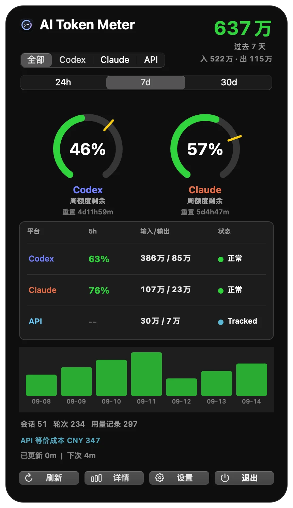
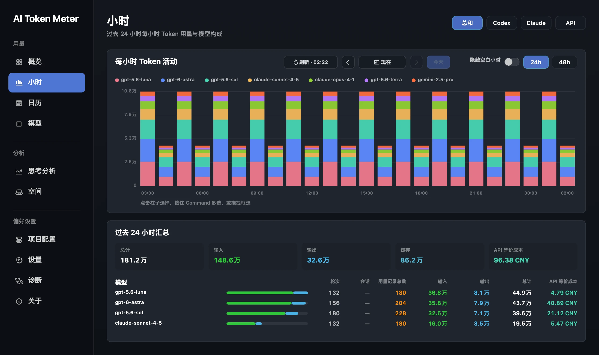
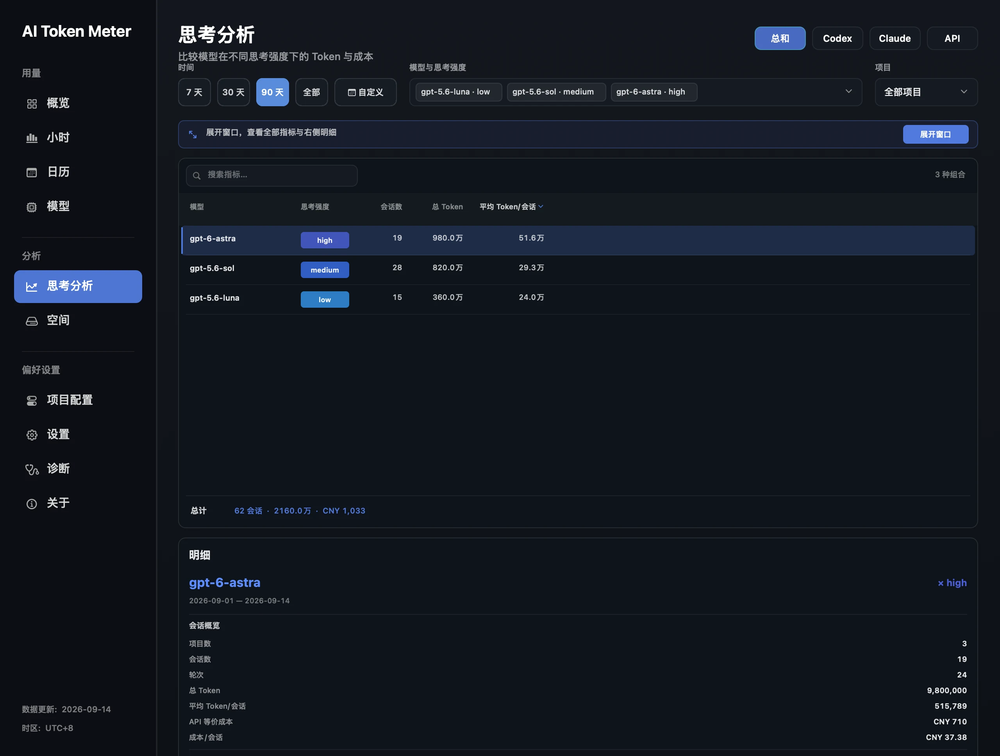
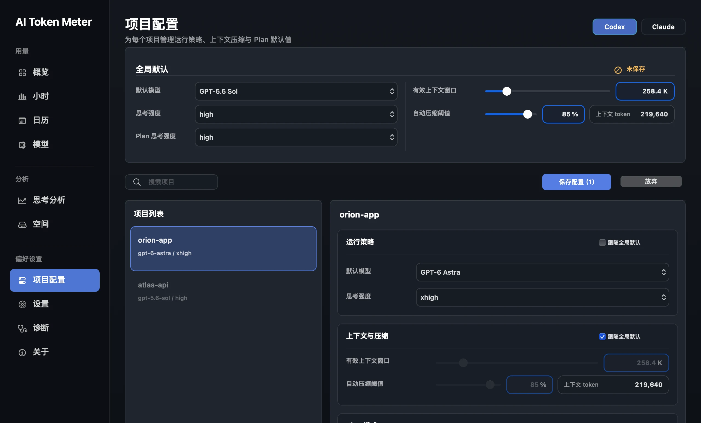
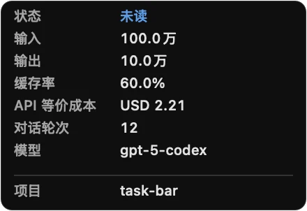
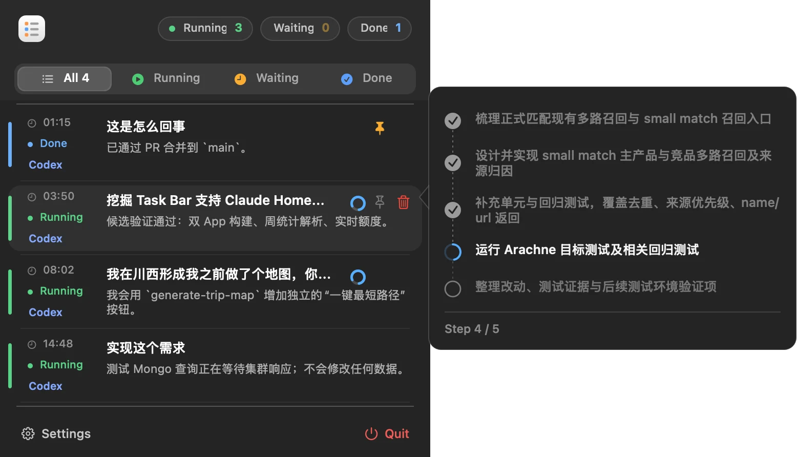

# AI Token Meter + Task Bar

两个免费、开源、原生的 macOS 菜单栏工具，用来观察 Codex、Claude Code、OpenCode / OpenChamber 的本地用量与任务状态。

- **AI Token Meter**：汇总 token、缓存、模型、额度周期、API 等价成本和本地磁盘占用。
- **Task Bar**：集中显示正在运行、等待输入、已完成未读的 AI 编程任务，并快速回到原任务。

应用只读取本机日志、数据库和已有登录状态，不上传会话内容，也不需要把 API Key 交给应用。

[普通用户安装教程](docs/INSTALL.zh-CN.md) · [中文详细说明](README.zh-CN.md) · [English](README.en.md) · [下载最新版](https://github.com/prefect12/codex-token-meter/releases/latest)

## 应用一览

| App | 当前源码版本 | 主要用途 | 安装位置 |
| --- | --- | --- | --- |
| AI Token Meter | `0.2.26 (40)` | 用量、额度、模型、成本、空间与配置 | `/Applications/AI Token Meter.app` |
| Task Bar | `0.1.22 (23)` | 多来源任务收件箱与快速跳转 | `/Applications/Task Bar.app` |

> `main` 可能领先于最近一次 GitHub Release。版本号来自当前源码的 bundle 元数据；下载页显示的是最近一次正式发布包。

## 下载与安装

GitHub Release 分别提供两个 DMG，按需要独立安装：

| App | DMG | 安装结果 |
| --- | --- | --- |
| AI Token Meter | `AI-Token-Meter-*.dmg` | `/Applications/AI Token Meter.app` |
| Task Bar | `Task-Bar-*.dmg` | `/Applications/Task Bar.app` |

打开 DMG 后把应用拖进 `Applications`。两个应用都常驻屏幕顶部菜单栏，不显示在 Dock。首次启动、安全提示、权限和版本检查见 [完整安装教程](docs/INSTALL.zh-CN.md)。

## AI Token Meter

### 菜单栏总览

<p align="center">
  
</p>

菜单栏面板把最常用的信息放在一屏：

- 在 `全部 / Codex / Claude / API` 之间切换来源。
- 在 `24h / 7d / 30d` 之间切换时间窗口。
- 查看 Codex 与 Claude 的剩余额度、重置时间和服务状态。
- 查看输入、输出、缓存、会话/轮次、用量记录数和 API 等价成本。
- 手动刷新，或进入完整详情窗口。

额度环显示的是**剩余额度**，不是已用比例。30 天总量在 Profile API 可用时优先采用账户聚合值；模型、日历和成本拆分仍来自本地可解释记录。

### 概览：长期用量和额度周期

<p align="center">
  
</p>

概览页回答“我整体用了多少、主要花在哪里”：

- Codex / Claude 周额度进度、重置时间和节奏标记。
- Codex 可用重置机会及倒计时。
- 全部、Codex、Claude、API 的总 token 与输入/输出拆分。
- 模型排行、缓存命中率和 API 等价成本。
- 过去一年的活动热力图，可按日期、周、月份或拖拽范围选择。

### 小时：最近 24/48 小时

<p align="center">
  
</p>

小时页按模型堆叠每小时 token，适合定位突然增长或某段高强度工作：

- `24h / 48h` 快速切换，也可选历史日期。
- 隐藏无活动小时，减少稀疏图表的空白。
- 点击单柱、按住 Command 多选，或拖拽框选一段时间。
- 下方同步汇总所选范围的输入、输出、缓存、模型与成本。
- 页面保持自动刷新，并提供手动刷新、spinner 和上次成功刷新时间。

### 日历：从一天到一段时间

<p align="center">
  
</p>

日历页展示过去一年的每日使用强度。可以点选单日、整周、整月、跨月范围，或按住 Command 组合选择。详情区会显示：

- 输入、输出、缓存与新输入。
- Codex、Claude、API 来源占比。
- 活跃天数、会话/轮次和峰值日期。
- 对应金额与逐模型 API 等价成本。

“对应金额”是本地订阅价值估算，“API 等价成本”是把已识别 token 按公开 API 价格换算；两者都不是账单。

### 模型：模型结构与价格覆盖

<p align="center">
  
</p>

模型页按 `7 天 / 30 天 / 90 天 / 全部 / 自定义` 汇总：

- token 占比、总量、输入、输出和缓存率。
- 会话数、用量记录数和逐模型 API 等价成本。
- 来源筛选、模型搜索和多列排序。
- 模型识别覆盖率与价格覆盖率。

未知模型保持未定价，并降低覆盖率；应用不会擅自套用另一个模型的价格。

### 思考分析：模型 × 思考强度

<p align="center">
  
</p>

思考分析页把真实会话按“模型 × reasoning effort”组合展开，可比较：

- 会话数、总 token、平均 token/会话。
- 总成本和单会话成本。
- 时间范围、来源、项目、模型和思考强度筛选。
- 组合明细、时间趋势与项目分布。

它只使用日志里实际存在的模型和 effort 标签，不会从 token 大小反推“快速模式”或未记录的服务档位。

### 项目配置：Codex 与 Claude 默认策略

<p align="center">
  
</p>

项目配置页统一管理全局默认和项目级覆盖：

- Codex 默认模型、思考强度、有效上下文窗口、自动压缩阈值和 Plan 思考强度。
- Claude Code 默认模型与 effort，以及项目级本地覆盖。
- 每个项目可选择跟随全局默认或单独覆盖。
- 可选“保护默认配置”，只恢复 Token Meter 管理的字段，不改写其他配置。

Codex 项目配置写入项目根目录的 `.codex/config.toml`；Claude 项目覆盖写入 `.claude/settings.local.json`。已有文件只做定向字段更新，不整体替换。

### 空间：日志占用与清理风险

<p align="center">
  
</p>

空间页是只读的磁盘分析器：

- 按 Codex / Claude、项目和文件类型统计占用。
- 展示最大项目、文件数和最近 14 天增长。
- 将内容分为“可安全清理 / 需确认 / 不建议清理”。
- 支持筛选、搜索、在访达中打开和导出报告。

页面不会自动删除任何文件；风险标签是操作建议，不是清理命令。

### 设置：显示、数据、成本、额度与系统

<p align="center">
  
</p>

设置页分为五组：

- **外观显示**：界面语言、金额币种、数字单位、显示来源和菜单栏数字。
- **数据来源**：Codex / Claude 日志目录、Codex API 身份来源、Profile API 总量与外部 `api-usage.json`。
- **成本与额度**：订阅计划、OpenRouter 余额/价格目录与自定义模型价格。
- **额度提醒**：圆环/子弹图样式、首页额度口径和提醒阈值。
- **系统**：开机启动等应用行为。

支持 English、简体中文、繁体中文、日本語、Français、Deutsch、Español 和 한국어。

### 诊断：知道数据为什么缺失

<p align="center">
  
</p>

诊断页把“没有数据”和“功能坏了”分开：

- 当前来源、缓存命中、模型、会话与轮次。
- 外部 API 成本文件是否存在及其路径。
- Codex、Claude Code、Cursor、OpenCode、Gemini CLI 等工具覆盖状态。
- OpenRouter 模型目录、登录状态或网络相关读数的可用性。

`--print-live`、Profile API、服务状态和截图渲染依赖本机登录或网络；这些外部读数不可用，不等同于本地解析器编译失败。

## Task Bar

### 多来源任务收件箱

<p align="center">
  
</p>

Task Bar 把 Codex、Claude Code、Claude Desktop Home 与 OpenCode / OpenChamber 的最近任务放进同一个菜单栏面板：

- 使用 `All / Running / Waiting / Done` 筛选。
- 显示来源、标题、最近摘要、运行时间和未读状态。
- 点击任务回到对应客户端或工作区。
- 支持置顶、折叠子代理，以及从本地列表隐藏任务。
- 被隐藏的项目不会删除原会话或日志；后续有新活动时可以重新出现。

Claude Desktop Home 的本地缓存不提供生成中状态，因此这里只显示最近/未读，不会伪造 Running。

### Hover：可解释的 token 与成本

<p align="center">
  
</p>

任务行 hover 可以显示状态、输入、输出、缓存率、API 等价成本、对话轮次、模型和项目。字段以来源日志实际提供的粒度为准；缺少输入/输出拆分或价格时直接省略，不猜测。

### 计划与子代理进度

<p align="center">
  
</p>

对于包含计划或子代理的 Codex 任务，Task Bar 可以预览步骤完成情况、当前步骤和子任务层级，不必逐个切回窗口判断进度。

## 数据来源与口径

### AI Token Meter 读取

```text
~/.codex/sessions/**/rollout-*.jsonl
~/.codex/archived_sessions/**/rollout-*.jsonl
$CODEX_HOME/sessions/**/rollout-*.jsonl
$CODEX_HOME/archived_sessions/**/rollout-*.jsonl
设置中添加的额外 Codex 日志目录
~/.claude/projects/**/*.jsonl
~/.local/share/opencode/opencode.db
~/Library/Application Support/Codex Token Meter/
```

- Codex `token_count` 是 rollout 内累计计数，应用按前后非负增量计算。
- Claude Code assistant usage 是每条消息计数，不按 Codex 的累计方式做 delta。
- OpenCode / OpenChamber assistant 消息按每条消息直接汇总，并归入 API 来源。
- Codex 与 Claude 订阅用量、订阅价值估算和 API 等价成本是三个不同口径。

实时 Codex 额度通过本机已有 ChatGPT 登录只读请求正常用量接口，不启动 `codex app-server`。成功结果会缓存；失败后按 1、5、15 分钟退避。Claude 额度优先使用已有的只读 OAuth/statusline 数据。服务状态来自 OpenAI 官方状态 JSON。

模型价格优先使用内置规则与 OpenRouter 公共 Models API。应用只缓存模型 ID 和价格，不向 OpenRouter 发送提示词、回复内容或 API Key。

### Task Bar 读取

```text
Codex: logs_2.sqlite / state_5.sqlite / sessions / archived_sessions
Claude Code: ~/.claude/projects/**/*.jsonl
Claude Desktop Home: 本地 IndexedDB conversation list cache
OpenCode / OpenChamber: ~/.local/share/opencode/opencode.db
```

所有目录都可以在 Task Bar 设置中选择。状态判断以本地可观察证据为准；“长时间无活动”不是服务端明确报告的停止状态。

## 隐私

- 不上传 Codex、Claude 或 OpenCode 会话内容。
- 不读取或保存第三方 API Key。
- 不在后台启动 Codex 进程获取额度。
- 本地缓存只保存聚合结果、额度快照、价格目录和设置。
- README 截图通过 `--demo-data` 生成；Token、额度、成本、日期、会话、项目与路径均来自内置演示数据，不读取截图作者的真实统计。

为了兼容旧版本，AI Token Meter 继续使用 `~/Library/Application Support/Codex Token Meter/` 保存设置和派生缓存。

## 从源码构建

要求：

- macOS 13 或更新版本
- Xcode Command Line Tools
- `swiftc`

构建 AI Token Meter：

```bash
./build.sh
```

构建 Task Bar：

```bash
./build_petbar.sh
```

## 从源码安装

普通用户无需执行下面的命令，请使用 GitHub Release 的 DMG。

```bash
./install.sh
./install_petbar.sh
```

两个安装脚本会分别构建、替换 `/Applications` 中的应用并启动。开发时仍应先完成对应构建和渲染检查。

## 打包 DMG

```bash
./package_dmg.sh
./package_petbar_dmg.sh
```

当前源码元数据对应的输出文件名：

```text
dist/AI-Token-Meter-0.2.26.dmg
dist/Task-Bar-0.1.22.dmg
```

## 命令行检查

AI Token Meter：

```bash
"./build/AI Token Meter.app/Contents/MacOS/CodexTokenMeter" --print --window=week --quota=all
"./build/AI Token Meter.app/Contents/MacOS/CodexTokenMeter" --print-live
"./build/AI Token Meter.app/Contents/MacOS/CodexTokenMeter" --print-profile
"./build/AI Token Meter.app/Contents/MacOS/CodexTokenMeter" --print-service-status
```

Task Bar：

```bash
"./build/Task Bar.app/Contents/MacOS/TaskBar" --print
"./build/Task Bar.app/Contents/MacOS/TaskBar" --self-test-plan-parser
"./build/Task Bar.app/Contents/MacOS/TaskBar" --self-test-task-routing
"./build/Task Bar.app/Contents/MacOS/TaskBar" --self-test-hover-cost
```

## 重新生成 README 截图

截图输出为 PNG。公开文档请使用 `--demo-data`：它会用内置演示数据替代账号统计、项目、路径和诊断结果。`--redact` 只适合临时隐藏仓库名与目录，不能代替完整脱敏。以下示例使用简体中文和中文数字单位，不会永久修改应用设置：

```bash
ATM="./build/AI Token Meter.app/Contents/MacOS/CodexTokenMeter"
TASK_BAR="./build/Task Bar.app/Contents/MacOS/TaskBar"

"$ATM" -appLanguage zh -numberUnitStyle chinese --render-dashboard=/tmp/ai-token-meter.png --demo-data
"$ATM" -appLanguage zh -numberUnitStyle chinese --render-details=/tmp/overview.png --section=overview --demo-data
"$ATM" -appLanguage zh -numberUnitStyle chinese --render-details=/tmp/hours.png --section=hours --demo-data
"$ATM" -appLanguage zh -numberUnitStyle chinese --render-details=/tmp/calendar.png --section=calendar --demo-data
"$ATM" -appLanguage zh -numberUnitStyle chinese --render-details=/tmp/models.png --section=models --demo-data
"$ATM" -appLanguage zh -numberUnitStyle chinese --render-details=/tmp/reasoning.png --section=reasoning --demo-data
"$ATM" -appLanguage zh -numberUnitStyle chinese --render-details=/tmp/project-config.png --section=model-routing --demo-data
"$ATM" -appLanguage zh -numberUnitStyle chinese --render-details=/tmp/storage.png --section=storage --demo-data
"$ATM" -appLanguage zh -numberUnitStyle chinese --render-details=/tmp/settings.png --section=settings --demo-data
"$ATM" -appLanguage zh -numberUnitStyle chinese --render-details=/tmp/diagnostics.png --section=diagnostics --demo-data

"$TASK_BAR" --render-taskbar=/tmp/task-bar.png --count=5
"$TASK_BAR" --render-taskbar-tooltip=/tmp/task-bar-tooltip.png
"$TASK_BAR" --render-taskbar-plan-hover=/tmp/task-bar-plan.png --count=4

cwebp -q 88 /tmp/overview.png -o docs/images/zh-details-overview.webp
```

渲染结果仍需逐张视觉检查；成功生成文件并不自动证明文字未裁切、布局没有重叠或真实点击交互已通过。

## License

见 [LICENSE](LICENSE)。
