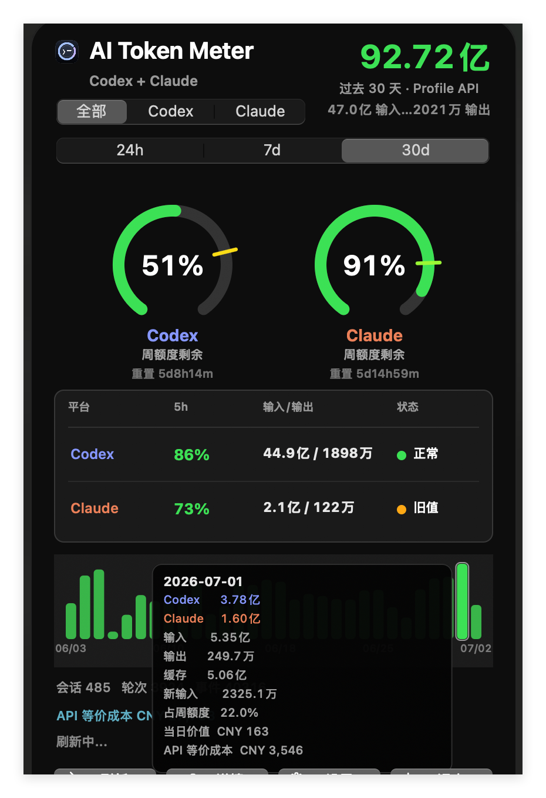
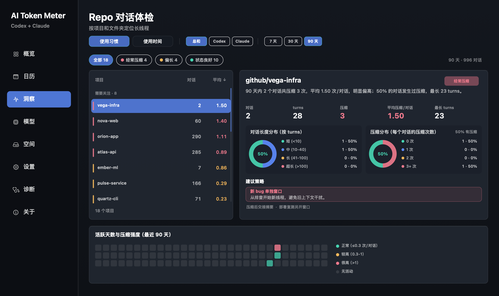
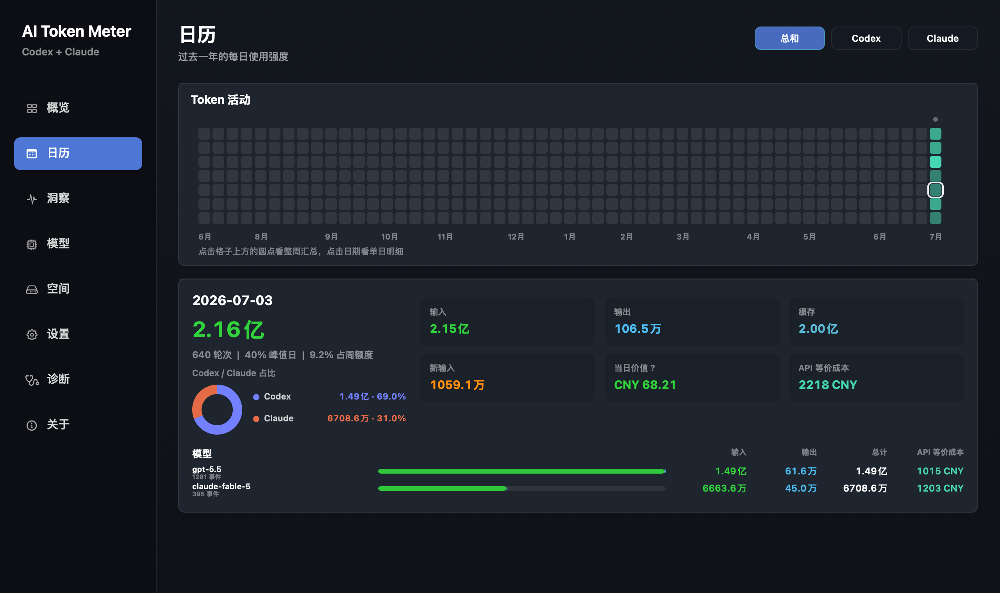
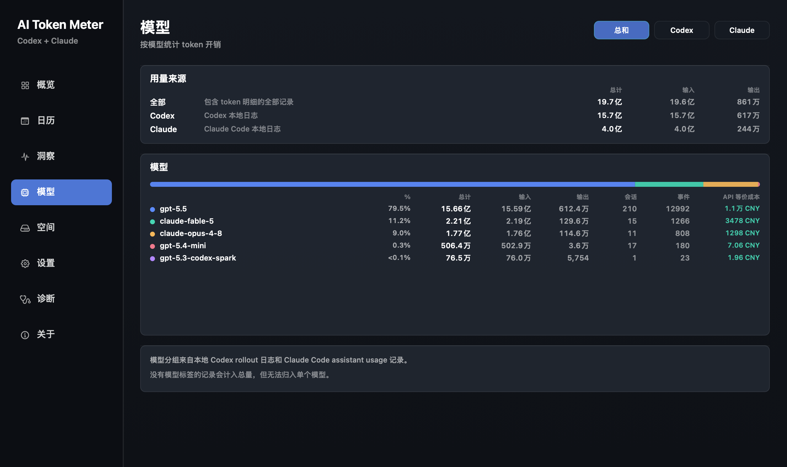
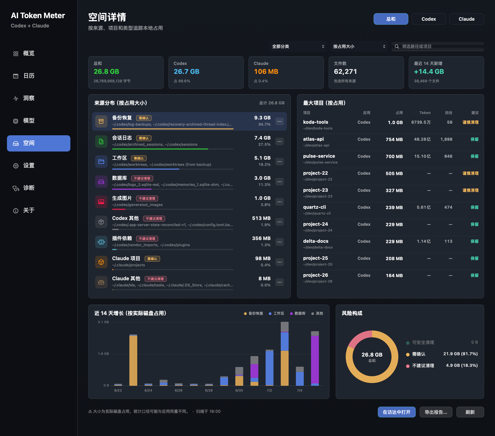
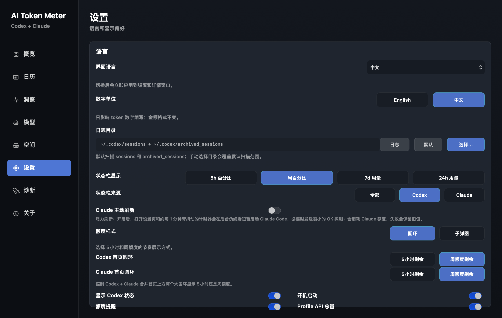
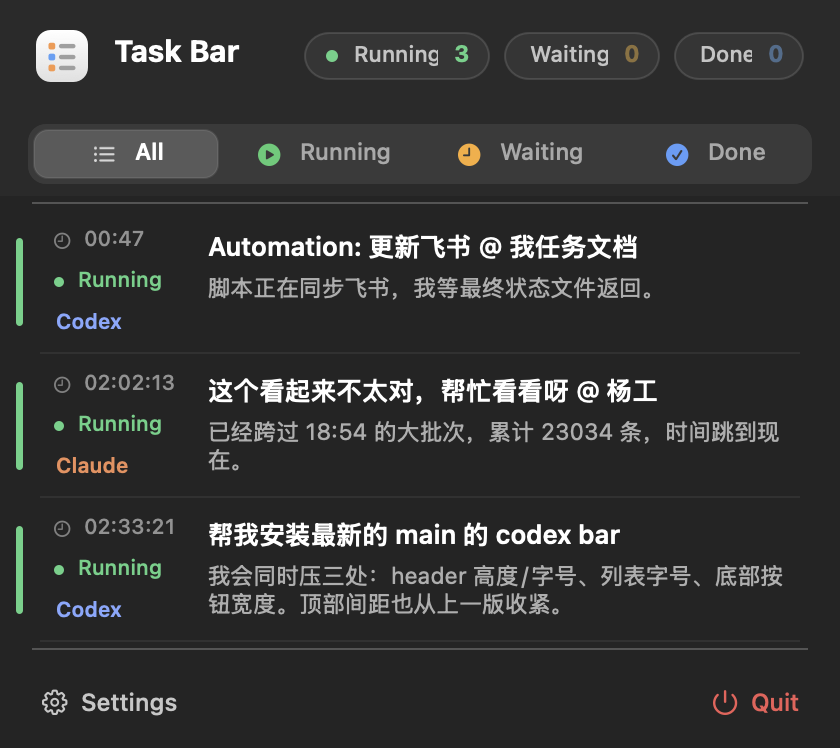
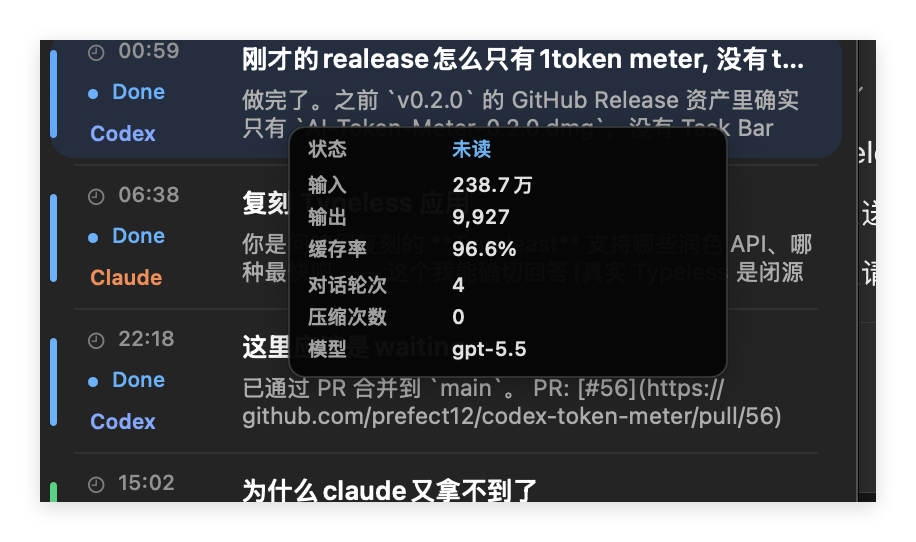

# AI Token Meter + Task Bar

两个原生 macOS 状态栏工具，面向本机 Codex 和 Claude Code 工作流。一个负责 token / 额度 / 成本观测，一个负责把正在跑、等待回复、已完成未读的任务收进状态栏。

- **AI Token Meter**：查看 Codex / Claude Code 的本地 token 用量、缓存命中率、实时剩余额度、模型统计、仓库洞察和订阅价值估算。
- **Task Bar**：把正在运行、等待输入、已完成但未读的 Codex / Claude Code 任务集中到一个轻量状态栏列表里，方便快速回到任务。

两者都只读取本机数据，不上传会话日志。

## 下载

最新版 GitHub Release 会同时提供两个 DMG：

| App | 安装包 | 安装位置 |
| --- | --- | --- |
| AI Token Meter | `AI-Token-Meter-0.2.5.dmg` | `/Applications/AI Token Meter.app` |
| Task Bar | `Task-Bar-0.1.3.dmg` | `/Applications/Task Bar.app` |

如果只安装 AI Token Meter，就只会得到 token / 额度面板；Task Bar 是独立状态栏 app，需要下载并安装 `Task-Bar-*.dmg`。

## 截图与交互

详情页截图使用内置的 `--redact` 渲染模式生成，仓库名和目录均替换为演示数据。

### AI Token Meter 总览

<p align="center">
  
</p>

AI Token Meter 的状态栏面板支持 `全部 / Codex / Claude` 和 `24h / 7d / 30d` 切换。顶部显示当前窗口总 token，环形图显示剩余额度，表格对比 Codex 与 Claude 的 5h 剩余额度、输入输出和服务状态，底部汇总会话/轮次/事件数与 API 等价成本。

### AI Token Meter Hover

<p align="center">
  
</p>

日历柱状图 hover 会显示单日拆分：Codex、Claude、输入、输出、缓存、新输入、占月额度、当日订阅价值估算和 API 等价成本。Profile API 可用时，30 天窗口会优先展示 Profile API 聚合总量；本地日志仍用于补充日历、模型和成本拆分。

### 详情窗口 · 概览

<p align="center">
  
</p>

过去 365 天按来源（全部 / Codex / Claude）和模型统计的总量、输入/输出拆分、缓存命中率、API 等价成本，以及全年活动热力图。

### 详情窗口 · 仓库洞察

<p align="center">
  
</p>

Repo 对话体检：按项目和文件夹定位长线程，统计对话长度分布、上下文压缩分布和活跃天数强度，并给出「新 bug 单独窗口」这类拆线程建议。支持 `使用习惯 / 使用时间` 两种视角和 `7 / 30 / 90 天` 窗口。

### 详情窗口 · 活动日历

<p align="center">
  
</p>

点击某一天查看单日明细：输入/输出/缓存拆分、Codex 与 Claude 占比圆环、当日订阅价值和逐模型 API 等价成本；点击格子上方的圆点可看整周汇总。

### 详情窗口 · 模型

<p align="center">
  
</p>

按模型聚合的长期 token 用量、占比条、会话/事件数和逐模型 API 等价成本。

### 详情窗口 · 空间

<p align="center">
  
</p>

按来源、项目和类型追踪本地日志磁盘占用：来源分布、最大项目排行、近 14 天增长曲线和清理风险构成，每一类都标注「可安全清理 / 需确认 / 不建议清理」，并支持导出报告和在访达中打开。

### 详情窗口 · 设置

<p align="center">
  
</p>

界面语言、数字单位、日志目录、状态栏显示与来源、额度样式（圆环/子弹图）、首页圆环口径（5 小时/周额度）、开机启动、额度提醒和 Profile API 总量等都可配置。

### Task Bar 总览

<p align="center">
  
</p>

Task Bar 把 Codex 和 Claude Code 任务合在一个小面板里，支持 `All / Running / Waiting / Done` 筛选。行内会显示任务状态、来源、标题、最近摘要和未读/等待状态，适合在多个 Codex 线程和 Claude 会话之间快速切换。

### Task Bar Hover

<p align="center">
  
</p>

任务行 hover 会显示该任务的可解释 token 摘要：状态、输入、输出、缓存率、对话轮次、压缩次数和模型。只有日志里能拆出来的字段才会展示；如果来源只提供总量，不会伪造输入/输出拆分。

## 当前版本

| App | Version | Build | Bundle |
| --- | --- | --- | --- |
| AI Token Meter | `0.2.5` | `19` | `/Applications/AI Token Meter.app` |
| Task Bar | `0.1.3` | `4` | `/Applications/Task Bar.app` |

## 数据来源

AI Token Meter 读取：

```text
~/.codex/sessions/**/rollout-*.jsonl
~/.codex/archived_sessions/rollout-*.jsonl
$CODEX_HOME/sessions/**/rollout-*.jsonl
$CODEX_HOME/archived_sessions/rollout-*.jsonl
~/.claude/projects/**/*.jsonl
~/Library/Application Support/Codex Token Meter/
```

Task Bar 读取：

```text
~/.codex/logs_2.sqlite
~/.codex/state_5.sqlite
~/.codex/sessions/**/rollout-*.jsonl
~/.claude/projects/**/*.jsonl
```

实时额度依赖本机 Codex runtime 的 `codex app-server`。Codex 服务状态 chip 会只读请求 `https://status.openai.com/api/v2/summary.json`。

## 功能概览

### AI Token Meter

- **额度视图**：支持 `All / Codex / Claude` 平台筛选，以及 `24h / 7d / 30d` 时间窗口。
- **剩余额度**：读取 Codex live rate limits 和 Claude statusline，可显示 5 小时、周/月剩余额度与重置时间。
- **token 明细**：汇总 input、output、cached input、fresh input、total、cache hit rate、会话数和轮次。
- **详情窗口**：包含概览、日历、仓库洞察、模型、空间、设置、诊断和关于页面。
- **仓库洞察**：按项目定位长线程和上下文压缩压力，附对话长度/压缩分布和拆线程建议。
- **API 等价成本**：估算同样的本地用量若直接按 API 计价的花费，覆盖首页、日历、模型和概览。
- **空间管理**：追踪 Codex / Claude 本地日志磁盘占用、近 14 天增长和清理风险构成，可导出报告。
- **截图渲染**：`--render-dashboard` / `--render-details` 命令行渲染任意页面，`--redact` 把仓库名和目录替换为演示数据。
- **启动体验**：状态栏和详情窗口会先显示上次完整聚合结果，再后台刷新本机日志。
- **多语言**：支持 English、简体中文、繁体中文、日本語、Français、Deutsch、Español、한국어。

### Task Bar

- **任务收件箱**：在状态栏显示需要关注的任务数量，减少在多个窗口里找线程。
- **状态分组**：按 `All / Running / Waiting / Done` 过滤，区分运行中、等待输入、已完成未读和长时间运行。
- **多来源合并**：读取 Codex app-server、Codex rollout logs、Claude Code JSONL，并尽量合并同一任务的状态。
- **行内摘要**：展示来源、标题、最近输出摘要、运行时间和未读状态。
- **hover 详情**：能显示 token、缓存率、轮次、压缩次数和模型，字段以本机日志实际可解释的数据为准。
- **快速清理**：支持滑动移除已处理项，并在设置里调整分组顺序和显示偏好。
- **视觉一致性**：使用和 AI Token Meter 接近的深色 AppKit 样式、紧凑行距、状态色和 hover card。

## 构建

要求：

- macOS 13 或更新版本
- Xcode Command Line Tools
- `swiftc`

构建 AI Token Meter：

```bash
./build.sh
```

构建 Task Bar：

```bash
./build_petbar.sh
```

## 安装

安装并启动 AI Token Meter：

```bash
./install.sh
```

安装并启动 Task Bar：

```bash
./install_petbar.sh
```

## 打包 DMG

打包 AI Token Meter：

```bash
./package_dmg.sh
```

输出：

```text
dist/AI-Token-Meter-0.2.5.dmg
```

打包 Task Bar：

```bash
./package_petbar_dmg.sh
```

输出：

```text
dist/Task-Bar-0.1.3.dmg
```

## 命令行检查

AI Token Meter：

```bash
"./build/AI Token Meter.app/Contents/MacOS/CodexTokenMeter" --print --window=week --quota=all
"./build/AI Token Meter.app/Contents/MacOS/CodexTokenMeter" --print-live
"./build/AI Token Meter.app/Contents/MacOS/CodexTokenMeter" --print-service-status
```

Task Bar：

```bash
"./build/Task Bar.app/Contents/MacOS/TaskBar" --print
```

渲染 README 截图（`--redact` 会把仓库名和本机目录替换为演示数据，`-appLanguage` / `-numberUnitStyle` 可临时指定语言，不会改动应用设置）：

```bash
"./build/AI Token Meter.app/Contents/MacOS/CodexTokenMeter" -appLanguage zh -numberUnitStyle chinese --render-dashboard=docs/images/ai-token-meter-release.png
"./build/AI Token Meter.app/Contents/MacOS/CodexTokenMeter" -appLanguage zh -numberUnitStyle chinese --render-details=docs/images/zh-details-insights.png --section=insights --redact
"./build/Task Bar.app/Contents/MacOS/TaskBar" --render-taskbar=docs/images/task-bar-release.png
```

## 隐私

这个仓库不包含你的 Codex 日志、Claude Code 日志、token 数据、构建产物或 DMG。应用运行时只在本机读取日志和缓存；不会上传会话内容。为了兼容旧版本，AI Token Meter 继续使用 `~/Library/Application Support/Codex Token Meter/` 保存本地设置和派生缓存。
