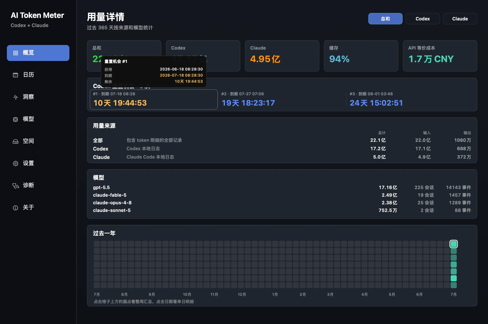
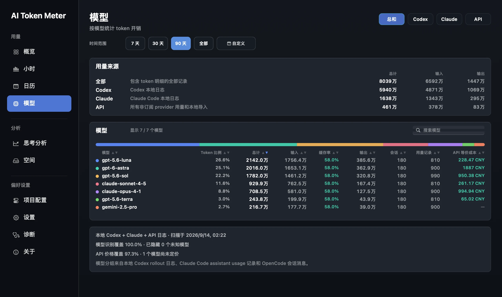
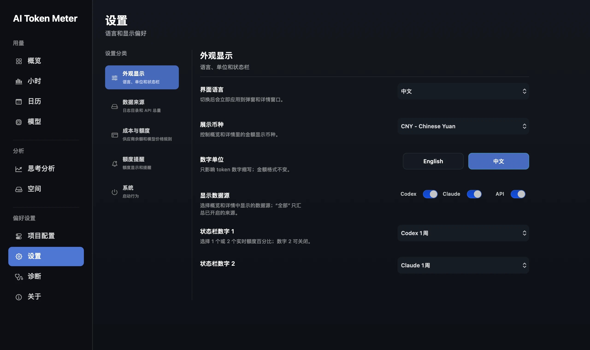

# AI Token Meter

[English README](README.en.md)

AI Token Meter 是一个原生 macOS 状态栏工具，用来查看本机 Codex 与 Claude Code 的 token 消耗、缓存命中率、实时剩余额度、模型级用量和订阅金额估算。

它直接读取本地 Codex 会话日志和 Claude Code 项目日志：

```text
~/.codex/sessions/**/rollout-*.jsonl
~/.codex/archived_sessions/rollout-*.jsonl
$CODEX_HOME/sessions/**/rollout-*.jsonl
$CODEX_HOME/archived_sessions/rollout-*.jsonl
~/.codex-api/sessions/**/rollout-*.jsonl
~/.codex-api/archived_sessions/rollout-*.jsonl
设置中添加的额外 Codex rollout 目录
~/.claude/projects/**/*.jsonl
```

在可用时，它还会通过本机 Codex 运行时读取实时限额信息，例如 5 小时窗口、周窗口、重置时间、剩余比例和 Codex reset credits。

## 截图

以下截图使用内置的 `--redact` 渲染模式生成，仓库名和目录均替换为演示数据。

### 状态栏面板

<p align="center">
  
</p>

支持 `全部 / Codex / Claude` 与 `24h / 7d / 30d` 切换；双平台剩余额度圆环、5 小时压力对比表、7 天用量柱状图和 API 等价成本一屏看完。

### 详情概览

<p align="center">
  
</p>

过去 365 天按来源和模型统计的总量、输入/输出拆分、Codex 重置机会倒计时和全年活动热力图。

### Codex 重置机会

<p align="center">
  
</p>

详情概览会显示 Codex reset credits 的剩余次数和逐条倒计时；hover 每条重置机会可查看获得时间、到期时间和剩余时间，hover 标题可查看这批数据的获取时间。

### 仓库洞察

<p align="center">
  
</p>

Repo 对话体检：按项目定位长线程和上下文压缩压力，给出对话长度分布、压缩分布、活跃天数强度和拆线程建议。

### 活动日历

<p align="center">
  
</p>

点击日期查看单日明细：输入/输出/缓存拆分、Codex 与 Claude 占比、当日订阅价值和 API 等价成本；点击格子上方的圆点可看整周汇总。

### 模型

<p align="center">
  
</p>

按模型聚合的 token 用量、占比条、会话/事件数和逐模型 API 等价成本。

### 空间

<p align="center">
  
</p>

按来源、项目和类型追踪本地日志磁盘占用：近 14 天增长、最大项目排行、清理风险构成，并支持导出报告和在访达中打开。

### 设置

<p align="center">
  
</p>

界面语言、数字单位、日志目录、状态栏显示与来源、额度样式、首页圆环口径、开机启动等都可配置。

### 诊断

<p align="center">
  
</p>

<details>
<summary>英文界面预览</summary>

### Menu Bar Dashboard

<p align="center">
  
</p>

### Repository Insights

<p align="center">
  
</p>

### Details Overview

<p align="center">
  
</p>

### Activity Calendar

<p align="center">
  
</p>

### Storage

<p align="center">
  
</p>

### Diagnostics

<p align="center">
  
</p>

</details>

## 功能

- 状态栏显示 5 小时剩余额度、周额度、当日 token 或 7 日 token。
- 弹窗支持 `24h / 7d / 30d` 时间窗口切换。
- 支持 `All / Codex / Claude` 数据源切换，以及 Codex 内部的模型限额/非模型限额视图。
- `All` 首页展示 Codex / Claude 双平台周额度圆环、5 小时压力、输入/输出、状态入口和按时间窗口聚合的柱状图。
- 详情概览展示 Codex reset credits 的剩余次数、逐条倒计时和 hover 明细。
- Claude 视图可通过 Claude Code statusline 读取官方 5 小时/7 天使用百分比；未配置时仍显示本地日志统计。
- 显示 5 小时和周额度节奏，可在圆环和子弹图样式之间切换。
- 显示缓存命中率圆环。
- 通过 `status.openai.com` 监控官方 Codex 服务状态，用一个极简的 Codex 状态 chip 展示，并可在设置里开关。
- 展示 input、output、cached input、fresh input 和 total token。
- 详情窗口包含概览、日历、洞察、模型、空间、设置、诊断和关于页面。
- 状态栏首页和详情窗口都会缓存聚合快照，打开或切换时先显示上次结果，再在后台刷新。
- 洞察页面会按仓库或文件夹聚合本地 Codex 与 Claude Code 对话，标出长线程、上下文压缩压力、活跃 worktree 和拆分新线程的建议。
- 过去 365 天日历热力图，点击日期看单日明细，点击格子上方的圆点看整周汇总。
- 模型页面按模型聚合长期 token 用量和逐模型 API 等价成本。
- 空间页面按来源、项目和类型追踪本地日志磁盘占用，展示近 14 天增长和清理风险构成，支持导出报告和在访达中打开。
- 内置 `--render-dashboard` / `--render-details` 截图渲染，配合 `--redact` 可将仓库名和目录替换为演示数据后公开分享。
- 诊断页面展示 Codex CLI/auth 状态、实时额度可用性、日志覆盖、可选 API 成本输入和其他工具探测结果。
- 默认覆盖当前会话、归档会话，以及已设置 `$CODEX_HOME` 时对应的会话目录。
- 支持 English、简体中文、繁体中文、日本語、Français、Deutsch、Español、한국어。
- 数字单位会跟随界面语言：英文使用 `K / M / B`，中文使用 `万 / 亿`。
- 可配置 Codex 日志目录、Codex API 来源、状态栏显示内容、额度展示样式、Codex 状态 chip 开关、开机启动和低额度提醒。
- 支持手动刷新、打开本地日志目录和命令行统计检查。

## 数据与计算口径

AI Token Meter 使用本机数据源：

- **token 用量**：来自本地 Codex 会话日志和 Claude Code 项目日志。Codex 默认扫描 `~/.codex/sessions`、`~/.codex/archived_sessions`、`~/.codex-api/sessions`、`~/.codex-api/archived_sessions`，以及设置了 `$CODEX_HOME` 时其中的 `sessions` / `archived_sessions` 目录；设置里添加的额外 Codex rollout 目录会追加到扫描范围。Codex 扫描 `token_count` 事件，读取 `input_tokens`、`cached_input_tokens`、`output_tokens`、`reasoning_output_tokens` 和 `total_tokens`，再用相邻累计值的差值计算本次新增 token。Claude Code 扫描 `CLAUDE_CONFIG_DIR`、`$XDG_CONFIG_HOME/claude/projects` 和 `~/.claude/projects` 下的 `*.jsonl` assistant usage 记录，读取 `input_tokens`、`cache_creation_input_tokens`、`cache_creation.ephemeral_5m_input_tokens`、`cache_creation.ephemeral_1h_input_tokens`、`cache_read_input_tokens` 和 `output_tokens`，保留同一 message 的最终/最大 token 快照，并按小时、日期、会话、模型和仓库聚合。
- **仪表盘缓存**：状态栏首页会把 `24h / 7d / 30d` 的 `全部 / Codex / Claude` 聚合结果缓存到本地 `dashboard-report-cache.json`。下次启动或切换窗口时会先展示上次聚合结果，再在后台刷新，不缓存原始日志内容。
- **详情页缓存**：详情窗口会把 365 天总览、日历、金额、模型和仓库洞察所需的聚合快照缓存到本地 `details-snapshot-cache.json`。打开详情页时先显示上次快照，再后台重算并替换；缓存会移除 top session 路径和仓库真实路径，只保留展示名与统计值。
- **实时额度比例**：Codex 来自本机 Codex 运行时。应用启动 `codex app-server`，调用 `account/rateLimits/read`，读取 5 小时窗口和周窗口的 `usedPercent`、`resetsAt` 等信息。Codex API 来源可在设置里配置，用于官方 live quota、Profile API totals 和 reset credits，不改变本地日志扫描范围。Claude 可通过 `--claude-statusline` 捕获 Claude Code statusline JSON 中的官方 `rate_limits`。状态栏和圆环里的剩余额度按 `100 - usedPercent` 显示。应用会从 Codex 实时返回里学习当前非 Codex 的模型级限额窗口，不再只依赖历史 Spark ID。
- **Codex reset credits**：应用通过本机 Codex runtime 读取 reset credits，在详情概览展示剩余次数和逐条倒计时。hover 单条重置机会会显示获得时间、到期时间和剩余时间；hover 标题会显示数据获取时间。
- **缓存比例**：来自本地 token 明细，计算方式是 `cached_input_tokens / input_tokens * 100`。
- **金额估算**：不是官方账单。Codex 和 Claude 各自保存月付金额、付款币种、展示币种和付费开始日期，默认沿用旧的 `$200` 设置；周预算按对应平台的 `月付金额 * 12 / 52` 计算。本周已用金额优先使用该平台实时周 `usedPercent` 换算，历史日期和历史周则按本地 token 用量、历史峰值和已记录的周额度比例估算。`全部` 金额页会把 Codex / Claude 的月费按各自付款币种折算到展示币种后合计。
- **API 等价成本**：这是另一套独立估算，用来回答“如果这些本地 token 直接按 API token 计费，大约会花多少钱”。应用会按可识别模型分别计价 fresh input、cached input 和 output。当前内置价格使用 GPT-5.5、GPT-5.4、GPT-5.4 mini 的官方 API 单价，GPT-5.3-Codex / GPT-5.2 风格 Codex 模型的 token-based Codex rate card 等价口径，以及 Claude Opus / Sonnet / Haiku 的官方 API 单价。`reasoning_output_tokens` 不会再次叠加，因为本地 Codex `token_count` 事件里的 `total_tokens` 已经等于 input 加 output。没有模型标签但有总 token 的 Profile API 单日数据，会按 GPT-5.5 fresh input fallback 估算，避免有覆盖率时金额仍为 0。无法识别模型标签的记录不会被强行估价，并会降低界面中的 priced-token 覆盖率。
- **仓库洞察**：完全来自本机 rollout 元数据和事件。洞察扫描器读取 `cwd`、`turn` 活动、`context_compacted` 信号和 `token_count` 增量，并把常规 `Documents/github/<repo>` 工作目录和 Codex 创建的 worktree 归并到同一个仓库显示名。它会展示对话数、turn 数、压缩次数、最长线程压力、活跃天数，以及何时拆到新线程的建议。
- **Codex speed tier / fast 模式**：历史本地日志不会被反推 fast/standard。当前 `rollout-*.jsonl` 元数据不暴露过去请求使用的是标准速度还是 fast 速度，所以应用不会根据 reasoning effort 或其他间接字段乱推 fast 模式。如果未来 Codex 的数据源提供每次请求的 speed tier，才能按请求明确计价。
- **外部 API 成本**：这是可选的本地 JSON 输入，用来补充不经过 Codex 日志的直接 OpenAI API 用量。默认读取 `~/Library/Application Support/Codex Token Meter/api-usage.json`。成本字段支持 `usd_value`、`total_usd`、`usd`、`cost_usd`，token 字段支持 `total_tokens`、`tokens`、`usage_tokens`。应用改名为 AI Token Meter 后仍沿用旧目录，避免升级时丢失设置、缓存和本地成本文件。

外部 API 成本文件示例：

```json
{
  "usd": 12.34,
  "total_tokens": 123456,
  "updated_at": "2026-06-15T00:00:00Z"
}
```

如果一周内 OpenAI 重置或刷新了额度，实时周比例会按新的 `usedPercent` 更新，所以状态栏和周额度圆环可能会突然显示更多剩余额度。本地 token 日志不会被清零；金额页会记录观察到的周使用比例下降，并保留历史周见过的最大周使用比例，避免历史金额在重置后被当前低比例冲掉。这个处理仍然是本地观测估算，不等同于官方账单导出。

如果通过 Codex CLI 或 Codex app 使用 API 登录状态启动任务，只要 Codex 仍然写入本地 `rollout-*.jsonl` 日志，本地 token 用量就可以继续统计；实时额度比例取决于 `codex app-server` 是否能在当前认证方式下返回 `account/rateLimits/read`。如果直接调用 OpenAI API 而不经过本机 Codex 客户端，可以通过可选的本地 `api-usage.json` 表示；应用本身不会主动调用账单 API。

## 最近更新

- `0.2.7` 更新所有 README 截图，补充 Codex reset credits 展示与 hover 数据说明；新增可配置 Codex API 来源、多 Codex 日志目录、模型行 hover 明细、详情概览按来源过滤、reset credit 获取时间 hover、设置页分组重排和 Task Bar 线程排序。
- `Task Bar 0.1.7` 支持 `.codex-api` 与额外 Codex 文件夹，合并多个 Codex home 的 app-server、state/log SQLite、sessions 和 archived sessions，并新增线程排序设置。
- `0.2.6` 在详情页总览新增 Codex reset credit 倒计时，并支持逐条 hover 查看获得时间、到期时间和剩余时间；Task Bar 同步包含 0.1.6 包里的标题、状态和计数可见性修复。
- `0.2.5` 暂时隐藏额度周期页面，等交互设计定稿后再回归；周期数据仍会在本地持续记录，不会丢失历史。
- 新增 `--redact` 截图渲染模式，导出截图时把仓库名和本机目录替换为演示数据，便于公开分享。
- 日历热力图的整周汇总从 hover 提示改为可点击的周圆点。
- 详情页所有页面改为全宽布局，并修复设置页详情渲染高度。
- 修复模型页占比条重叠问题。
- 诊断页的 Codex CLI 路径改用 `~` 缩写显示。
- `0.2.0` 将应用名更新为 AI Token Meter，安装包改为 `/Applications/AI Token Meter.app`，安装脚本会移除旧的 `/Applications/Codex Token Meter.app`，但继续使用旧 App Support 目录保存本地数据。
- 新增 Codex + Claude 总览首页：顶部双平台剩余额度圆环、平台对比表格、24h/7d/30d 用量柱状图和 Codex/Claude hover 区分。
- 新增 Claude Code 本地日志扫描，支持 `~/.claude/projects`、`CLAUDE_CONFIG_DIR` 和 `$XDG_CONFIG_HOME/claude/projects` 下的 assistant usage JSONL。
- 新增 Claude Code statusline 集成，可读取官方 5 小时和 7 天 quota 百分比；没有 statusline 时仍保留本地日志用量统计。
- 单独的 Codex / Claude 页面保持原来的三圆环和柱状图视图，只有 `全部` 首页使用新的平台总览表。
- 金额页支持 Codex / Claude 独立套餐成本和币种配置，避免两个平台共用同一套月费估算。
- 状态栏首页新增聚合结果磁盘缓存，刷新中继续保留平台输入/输出数据，避免表格短暂显示 `-- / --`。
- 详情页新增聚合快照磁盘缓存和后台预热，打开详情窗口时可先显示上次完整页面，再自动刷新为最新数据。
- 新增仓库洞察页面，用来识别 Codex 长线程、上下文压缩压力、活跃 worktree 和按项目拆分新线程的建议。
- 更新洞察页项目列表，只显示最后一级仓库名，例如 `github/CampaignStrategy` 和 `github/CodexTokenMeter` 会显示为 `CampaignStrategy` 和 `CodexTokenMeter`。
- 将原先 9k 行的 Swift 单入口文件拆分为领域模型、设置、扫描器、成本估算、状态栏 UI、详情页 UI、App 编排和 CLI helper 等独立源码文件。
- 新增 `AGENTS.md` 和 `docs/ARCHITECTURE.md`，方便 AI 协作开发时快速定位文件，并保留 token、额度和成本估算的关键口径。
- 更新构建脚本，自动编译 `Sources/CodexTokenMeter` 下的全部 Swift 源文件。
- 新增按 rollout 文件的日级聚合缓存，`7d`、`30d` 和年度详情扫描可以复用聚合摘要，不再每次遍历缓存里的全部事件。
- 保留滚动 `24h` 窗口的事件级精确计算，同时加速自然日窗口和详情页预热扫描。
- 支持从旧版解析缓存迁移到新版聚合缓存，未变化的 JSONL 日志不需要重新读取。
- 提升状态栏弹窗的次级文字对比度，并为主要操作按钮加入 SF Symbol 图标。
- 为额度圆环、分段控件、设置输入框、下拉框和开关补充基础辅助功能标签。
- 新增基于 `status.openai.com` 的 Codex 服务状态 chip，并提供 `--print-service-status` 诊断命令。
- 新增额度展示样式设置，可在圆环和子弹图之间切换 5 小时/周额度节奏展示。
- 修正额度文案和视觉口径，统一强调“剩余额度”，避免已用比例和剩余比例混用。
- 为只有总 token、没有模型标签的 Profile API 单日用量增加 GPT-5.5 fallback，避免有 token 覆盖时金额仍显示为 0。
- 将历史金额和额度价值估算收敛到统一的 `CostEstimator`，复用于日历详情、模型行、金额总览、悬浮提示和历史金额页面。
- 修复多语言数字单位和详情窗口局部布局间距问题。

## Codex 官方最佳实践

本仓库落地了 OpenAI 官方 [Codex best practices](https://developers.openai.com/codex/learn/best-practices)、[prompting](https://developers.openai.com/codex/prompting) 和 [AGENTS.md](https://developers.openai.com/codex/guides/agents-md) 指南中的多条实践：

- 给 Codex 明确任务上下文：在要求改代码前说明目标、相关文件或错误、约束，以及完成标准。
- 复杂任务先规划：当需求模糊、风险较高或会跨多个文件时，先使用 Plan mode，或让 Codex 先反问并收敛方案，再进入实现。
- 把可复用规则放进 `AGENTS.md`：仓库结构、构建命令、验证方式、计量口径、隐私边界和 PR 要求应写成持久指令，而不是每次 prompt 重复。
- 保持指令实用且有边界：优先维护短而准确的 `AGENTS.md`；更大的说明拆到 `docs/ARCHITECTURE.md` 这类聚焦文档。
- 有意识地配置 Codex：用 `config.toml` 保存模型、reasoning effort、sandbox、approval policy 和 MCP 等持久默认值；一次性需求再使用临时覆盖。
- 默认收紧 sandbox 和 approvals：只有可信 workflow 才扩大权限，优先用明确 writable roots 或 allow rules，而不是直接取消边界。
- 验证并审查改动：让 Codex 运行相关 build、CLI、render、lint 或测试检查；接受或合并前先看 diff。
- 把重复流程沉淀为 skills：聚焦的 skill 可以封装指令、参考资料和可选脚本，用于发布准备、代码审查或诊断等重复任务。
- 用 MCP 接入实时外部上下文：当任务依赖仓库外数据时，把 Codex 连接到官方文档、GitHub、浏览器自动化或设计系统等工具。
- 谨慎使用 hooks 和 automations：hooks 可在生命周期节点强制检查，automations 可执行周期性工作；无人值守流程应保持保守权限，并产出可审查结果。

## 隐私说明

这个项目只包含应用源码和静态资源，不包含你的 Codex 日志、token 消耗数据、截图、构建产物或 DMG。

应用运行时会读取：

```text
~/.codex/sessions
~/.codex/archived_sessions
~/.codex-api/sessions
~/.codex-api/archived_sessions
$CODEX_HOME/sessions
$CODEX_HOME/archived_sessions
设置中添加的额外 Codex rollout 目录
~/Library/Application Support/Codex Token Meter/ParsedRollouts
~/Library/Application Support/Codex Token Meter/api-usage.json
```

这些数据只在本机使用。应用不会上传会话日志。为了兼容旧版本，App Support 目录名仍保留为 `Codex Token Meter`。为了展示 Codex 状态 chip，应用会只读请求 `https://status.openai.com/api/v2/summary.json`；另外还会调用本机 Codex 运行时读取实时额度。实时限额读取依赖本机 Codex 运行时，`codex app-server` 本身可能会通过你现有的 Codex 登录状态访问 Codex 的正常用量接口。

## 构建

要求：

- macOS 13 或更新版本
- Xcode Command Line Tools
- 已安装 `swiftc`

构建应用：

```bash
./build.sh
```

构建结果：

```text
build/AI Token Meter.app
```

安装到 `/Applications` 并启动：

```bash
./install.sh
```

打包 DMG：

```bash
./package_dmg.sh
```

DMG 输出路径：

```text
dist/AI-Token-Meter-<version>.dmg
```

## 命令行检查

应用也支持从命令行打印统计结果，便于排查解析结果：

```bash
"./build/AI Token Meter.app/Contents/MacOS/CodexTokenMeter" --print --hours=168
```

指定窗口和视图：

```bash
"./build/AI Token Meter.app/Contents/MacOS/CodexTokenMeter" --print --window=month --quota=all
"./build/AI Token Meter.app/Contents/MacOS/CodexTokenMeter" --print --window=week --quota=claude
```

要让 app 显示 Claude Code 官方 5 小时/7 天额度，在 Claude Code statusline 配置里使用：

```bash
"/Applications/AI Token Meter.app/Contents/MacOS/CodexTokenMeter" --claude-statusline
```

如果要直接检查 OpenAI / Codex 服务状态：

```bash
"./build/AI Token Meter.app/Contents/MacOS/CodexTokenMeter" --print-service-status
```

如果要渲染详情窗口做视觉检查，包括洞察页：

```bash
"./build/AI Token Meter.app/Contents/MacOS/CodexTokenMeter" --render-details=/tmp/ai-token-meter-insights.png --section=insights --insight-window=90
```

JSON 输出会包含 `model_limit_id`、`model_limit_name`、API 等价成本字段、`external_api_cost` 状态；使用 `--print-service-status` 时还会输出服务状态字段。

## 项目结构

```text
Sources/CodexTokenMeter/main.swift   命令行入口和 App 启动
Sources/CodexTokenMeter/*.swift      领域模型、设置、解析器、成本估算和 AppKit UI 模块
Resources/                          应用图标和状态栏资源
Tools/                              图标生成脚本
docs/ARCHITECTURE.md                代码地图、数据流、关键口径和重构路径
AGENTS.md                           面向 AI 协作开发的接手说明
Info.plist                          macOS App 元信息
build.sh                            构建 .app
install.sh                          安装到 /Applications
package_dmg.sh                      打包 DMG
```

## License

MIT
