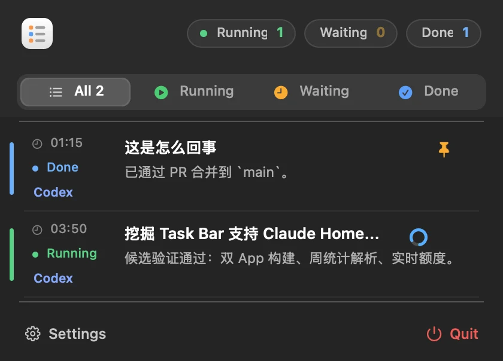

# AI Token Meter 与 Task Bar 安装教程

这份教程面向直接下载安装包的普通 macOS 用户，不需要 Xcode、Swift 或终端命令。

## 安装前确认

- 系统要求：macOS 13 Ventura 或更新版本。
- 请只从项目的 [GitHub Releases 最新版页面](https://github.com/prefect12/codex-token-meter/releases/latest) 下载安装包。
- AI Token Meter 和 Task Bar 是两个独立应用，需要分别下载安装：

| 你想使用的功能 | 下载文件 | 安装后的应用 |
| --- | --- | --- |
| Codex / Claude Code token、额度和成本面板 | `AI-Token-Meter-*.dmg` | `/Applications/AI Token Meter.app` |
| Codex / Claude Code 任务状态栏 | `Task-Bar-*.dmg` | `/Applications/Task Bar.app` |

只需要用量面板时，可以只安装 AI Token Meter。

## 第一步：下载 DMG

1. 打开 [GitHub Releases 最新版页面](https://github.com/prefect12/codex-token-meter/releases/latest)。
2. 展开该版本的 **Assets**。
3. 下载 `AI-Token-Meter-*.dmg`。如果还需要任务状态栏，再下载 `Task-Bar-*.dmg`。
4. 等待浏览器完成下载，不要从第三方网盘或转载页面获取安装包。

## 第二步：拖入“应用程序”

两个安装包的操作方法相同：

1. 在“下载”文件夹中双击 `.dmg` 文件。
2. 在打开的安装窗口中，把应用图标拖到 **Applications（应用程序）** 图标上。
3. 等待复制完成。
4. 在访达侧边栏点按 DMG 名称旁的推出按钮，然后可以删除下载的 `.dmg` 文件。

安装完成后，应能在“访达 → 应用程序”中看到 `AI Token Meter` 或 `Task Bar`。更新版本时重复以上步骤，并在系统询问时选择“替换”即可；本地设置和派生缓存不会保存在应用包内。

## 第三步：首次启动

1. 打开“访达 → 应用程序”。
2. 双击 `AI Token Meter` 或 `Task Bar`。
3. 应用启动后会出现在屏幕顶部菜单栏，不会在 Dock 中显示，这是正常设计。
4. 点按菜单栏图标即可打开面板。

如果菜单栏图标没有出现，先在“活动监视器”中搜索应用名称；确认应用没有运行后，再从“应用程序”文件夹重新打开。菜单栏空间不足时，macOS 也可能隐藏靠后的图标，可以先退出几个菜单栏应用再检查。

## macOS 提示“无法验证开发者”时

当前发布包可能触发 macOS Gatekeeper 安全提示。只有在安装包来自本项目官方 GitHub Releases 页面时，才继续以下操作：

1. 在拦截提示中点按“完成”或“取消”。
2. 打开“系统设置 → 隐私与安全性”。
3. 向下滚动到“安全性”，找到刚刚被阻止的 `AI Token Meter` 或 `Task Bar`。
4. 点按“仍要打开”，按 macOS 要求使用密码或 Touch ID 确认。
5. 在最后一次确认窗口中点按“打开”。

也可以在“应用程序”文件夹中按住 Control 键点按应用，选择“打开”，再在确认窗口中选择“打开”。这个确认通常只需要对当前版本执行一次。

如果系统提示“应用已损坏”或安装包无法挂载，不要用命令关闭 Gatekeeper，也不要删除系统隔离属性。请删除该文件，从官方 Releases 页面重新下载；仍然失败时，在项目 GitHub Issues 中附上 macOS 版本、安装包文件名和完整错误文字。

## 权限说明

两个应用都以读取本机数据为主，不会上传 Codex 或 Claude Code 会话日志。

### 隐私承诺

- Codex / Claude Code 的提示词、代码、会话记录、日志文件及 token 明细只在本机读取和计算，不会上传给开发者，也不会发送到广告或第三方统计平台。
- 两个应用都不包含遥测、广告或用户行为追踪 SDK。
- Task Bar 只在本机读取任务状态和保存应用设置。
- AI Token Meter 只有在显示实时额度或服务状态时，才会直接访问 OpenAI / Anthropic 官方接口；这些请求不会携带本机日志或会话内容。断网后，本地统计仍可正常使用。

| 项目 | 是否必须 | 用途 |
| --- | --- | --- |
| 完全磁盘访问 | 不需要 | 默认日志目录位于当前用户目录，应用只读扫描这些日志。 |
| 辅助功能、屏幕录制、相机、麦克风 | 不需要 | 应用不依赖这些系统权限。 |
| 网络连接 | 本地统计不需要 | AI Token Meter 使用网络读取实时额度和 OpenAI / Anthropic 服务状态；断网时本地 token 统计仍可使用。 |
| Claude Code 钥匙串访问 | 可选 | 如果本机 Claude Code 凭据存放在钥匙串中，AI Token Meter 可能请求读取 `Claude Code-credentials`，用于获取实时 Claude 额度。拒绝后仍可读取本地 Claude 日志。 |
| 登录时打开 | 可选 | 只在应用设置中开启“开机启动”后使用，可在 macOS“登录项”中关闭。 |

遇到钥匙串提示时，先确认请求方是 `AI Token Meter`，访问项目是 `Claude Code-credentials`。只有你希望显示 Claude 实时额度时才允许；不确定时可以拒绝，不影响 Codex/Claude 本地 token 统计。

## 第四步：确认安装成功

### AI Token Meter

完成以下核对即可确认应用已正确安装并运行：

- “访达 → 应用程序”中存在 `AI Token Meter.app`。
- 屏幕顶部菜单栏出现 AI Token Meter 图标。
- 点按图标能看到 `全部 / Codex / Claude` 和 `24h / 7d / 30d` 切换项。
- 使用过 Codex 或 Claude Code 后，面板能显示本地 token 数据；实时额度暂时不可用不代表安装失败。
- 需要排查数据源时，打开“详情 → 诊断”，查看日志覆盖和实时额度状态。

安装成功后的面板应接近下面的界面；具体数字取决于你的本地使用记录和登录状态。

<p align="center">
  
</p>

### Task Bar

完成以下核对即可确认 Task Bar 已正确安装并运行：

- “访达 → 应用程序”中存在 `Task Bar.app`。
- 屏幕顶部菜单栏出现 Task Bar 图标。
- 点按图标能看到 `All / Running / Waiting / Done` 筛选项。
- 有 Codex 或 Claude Code 任务时，列表会显示任务状态；当前没有任务时，空列表不代表安装失败。

安装成功并检测到任务后，面板应接近下面的界面：

<p align="center">
  
</p>

## 卸载

1. 从菜单栏面板中退出应用，或在“活动监视器”中结束应用。
2. 在“访达 → 应用程序”中把 `AI Token Meter.app` 或 `Task Bar.app` 移到废纸篓。
3. 如果启用过“开机启动”，可在删除应用前先在设置中关闭，或到“系统设置 → 通用 → 登录项”中移除。

仅删除应用不会自动删除 AI Token Meter 的本地设置和派生缓存。它们位于 `~/Library/Application Support/Codex Token Meter/`；这个目录不包含应用上传的数据，因为应用不会上传会话内容。

## 开发者从源码安装

只有准备修改或自行构建代码时才需要终端：

```bash
./install.sh
./install_petbar.sh
```

这两个脚本会先构建，再分别把应用安装到 `/Applications` 并启动。源码构建要求 Xcode Command Line Tools 和 `swiftc`。
